# 소프트웨어 개발

## 자료구조

### 분류

#### 선형 구조(Linear Structure)

- 배열(Array)
- 스택(Stack)
- 큐(Queue)
- 데크(Deque)
- 선형 리스트(Linear List) = 연속 리스트(순차적임), 연결 리스트(순차적이지 않음)

#### 비선형 구조(Non-Linear Structure)

- 트리(Tree)
- 그래프(Graph)

### Array(배열)

- **정적인 자료 구조**로 **기억장소의 추가**가 어렵고 **메모리의 낭비가 발생**함
- **첨자**(Subscript)를 이용
- **반복적인 데이터 처리 작업**에 적합한 구조
- 데이터마다 **동일한 이름의 변수를 사용**해 처리가 간편함

### Stack

- 리스트의 **한쪽 끝으로만 자료의 삽입, 삭제 작업**이 이뤄지는 자료 구조
- 후입선출(**LIFO**; Last In First Out) 방식

### Queue

- 리스트의 **한쪽에서는 삽입 작업, 다른 한쪽에서는 삭제 작업**이 이뤄지는 자료 구조
- 선입선출(**FIFO**;First In First Out) 방식
- 시작(F, Front)과 끝(R, Rear)을 표시하는 두 개의 포인터가 있음
- 운영체제의 작업 스케줄링에 사용함

### Deque

- 리스트의 **양쪽 끝에서 삽입과 삭제작업**을 할 수 있는 자료 구조

### Linear List(선형 리스트)

#### Continuous List(연속 리스트)

- 배열과 같이 **연속되는 기억장소에 저장**되는 자료 구조
- 기억장소를 연속적으로 배정받아, **기억장소 이용 효율은 밀도가 1로서 가장 좋음**
- 중간에 데이터를 삽입하기 위해 **연속된 빈 공간이 있어야**함
- **삽입, 삭제 시 자료의 이동이 필요**함

#### Linked List(연결 리스트)

- 자료들을 반드시 연속적으로 배열시키지 않고 임의의 기억공간을 기억시키되, 자료 항목의 순서에 따라 **노드의 포인터 부분을 이용해 서로 연결**시킨 자료 구조
- 노드의 **삽입, 삭제 작업이 용이**
- 기억공간이 연속적으로 놓여 있지 않아도 저장가능
- 연결을 위한 포인터가 필요하기 때문에 **순차 리스트에 비해 기억 공간의 효율이 좋지 않음**
- 연결을 위한 포인터를 찾는 시간이 필요하기 때문에 **접근 속도가 느림**
- 중간 노드 연결이 끊어지면 그 다음 노드를 찾기 힘듦

#### Tree

- **정점**(Node, 노드)과 **선분**(Branch, 가지)을 이용해 **사이클을 이루지 않도록** 구성한 그래프(Graph)의 특수한 형태

  - Node: 트리의 기본 요소, 자료 항목과 다른 항목에 대한 가지(Branch)를 합친 것
  - Root Node: 트리의 맨 위에 있는 노드
  - **Degree**(<u>차수</u>): 각 노드에서 뻗어 나온 가지의 수 ⭐️
  - **단말 노드**(<u>Terminal</u> Node): 자식이 하나도 없는 노드, Degree가 0인 노드 ⭐️
  - 자식 노드(Son Node): 어떤 노드에 연결된 다음 레벨의 노드들
  - 부모 노드(Parent Node): 어떤 노드에 연결된 이전 레벨의 노드들
  - 형제 노드(Brother Node, Sibling): 동일한 부모를 갖는 노드들
  - 트리의 디그리: 노드들의 디그리 중에서 가장 많은 수

- ##### 차수(Degree)와 단말(Terminal)의 수를 물어보는 문제 (기출)

  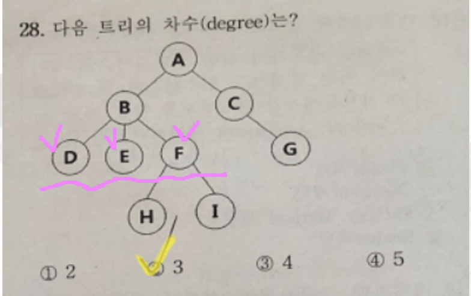

  - 차수(Degree): 3 - D, E, F (B의 자식 노드)
  - 단말(Terminal): 5 - D, E, H, I, G (자식이 하나도 없는 노드)

#### Graph

- 방향 그래프

  - 정점을 연결하는 선에 **방향이 있는 그래프**
  - n개의 정점으로 구성된 **방향 그래프의 최대 간선 수 = n(n-1)**

- 무방향 그래프
  - 정점을 연결하는 선에 **방향이 없는 그래프**
  - n개의 정점으로 구성된 **무방향 그래프의 최대 간선 수 = n(n-1)/2**

## Database / DBMS ⭐️

### 데이터베이스(Database) ⭐️

- 공용 데이터(Shared Data): 여러 응용 시스템들이 **공동으로 소유하고 유지**하는 자료
- 통합된 데이터(Integrated Data): 자료의 **중복을 최대로 배제**한 데이터의 모임
- 운영 데이터(Operational Data): 고유한 업무를 수행하는 데 **없어서는 안 될** 자료
- 저장된 데이터(Stored Data): 컴퓨터가 접근할 수 있는 **저장 매체에 저장된** 자료

### DBMS(Database Management System; 데이터베이스 관리 시스템)

- 사용자와 데이터베이스 사이에서 사용자의 요구에 따라 정보를 생성해주고, 데이터베이스를 관리해 주는 **소프트웨어**
  - 정의 기능: 데이터베이스에 저장될 데이터의 타입과 구조에 대한 정의, 이용 방식, 제약 조건 등을 명시하는 기능 → **DDL**
  - 조작 기능: 사용자와 데이터베이스 사이의 인터페이스 수단을 제공하는 기능 → **DML**
  - 제어 기능: 무결성, 보안, 권한, 병행 제어 → **DCL**

## 데이터 입, 출력 ⭐️⭐️

### SQL(Structured Query Language)

- 1974년 IBM 연구소에서 개발한 SEQUEL에서 유래함
- 관계대수와 관계해석을 기초로 한 혼합 데이터 언어
  - 데이터 정의어(DDL; Data Define Language): Domain(**도**메인), Schema(**스**키마), Table(**테**이블), View(**뷰**), Index(**인**덱스)를 정의하거나 변경 또는 삭제할 때 사용하는 언어
  - 데이터 조작어(DML; Data Manipulation Language): **SELECT(검색), INSERT(삽입), UPDATE(갱신), DELETE(삭제)**로 저장된 데이터를 실질적으로 처리하는 데 사용하는 언어
  - 데이터 제어어(DCL; Data Control Language): 데이터의 **무결성, 보안, 회복, 병행 제어** 등을 정의하는 데 사용되는 언어

### 데이터 접속(Data Mapping)

- 소프트웨어의 기능 구현을 위해 **프로그래밍 코드와 데이터베이스의 데이터를 연결(Mapping)하는 것**을 말함
  - SQL Mapping: 프로그래밍 코드 내 SQL을 직접 입력해 DBMS의 데이터에 접속하는 기술 ⭐️
    - JDBC, ODBC, MyBatis
  - ORM(Object-Relational Mapping): 객체(Object)와 관계형데이터베이스(RDB)의 데이터를 연결(Mapping)하는 기술 ⭐️
    - JPA, Hibernate, Django

### Transaction ⭐️⭐️

- 데이터베이스의 상태를 변환시키는 **하나의 논리적 기능을 수행하기 위한 작업의 단위**
- 한꺼번에 모두 수행되어야 할 **일련의 연산들**
  - COMMIT: 트랜잭션 처리가 **정상적으로 종료**되어 수행한 **변경 내용을 DB에 반영**하는 명령어
  - ROLLBACK: 트랜잭션 처리가 **비정상으로 종료**되어 DB의 길관성이 깨졌을 때 트랜잭션이 **행한 모든 변경 작업을 취소하고 이전 상태로 되돌리는 연산**
  - SAVEPOINT(=CHECKPOINT): 트랜잭션 내에서 **ROLLBACK할 위치인 저장점을 지정**하는 명령어, 여러 개의 SAVEPOINT 지정 가능
    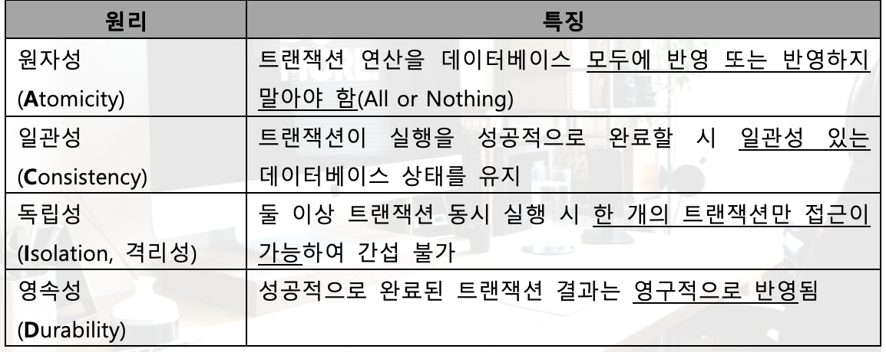
    - **ACID**

## 절차형 SQL

### 개요

- C, JAVA 등의 프로그래밍 언어와 같이 **연속적인 실행이나 분기, 반복 등의 제어가 가능한 SQL**
- 일반적인 **프로그래밍 언어에 비해 효율이 떨어짐**
- **연속적인 작업들을 처리**하는데 적합
- **BEGIN ~ END 형식**으로 작성되는 블록(Block) 구조로 기능별 모듈화 가능
  - **Procedure**: 호출을 통해 실행되어 **미리 저장해 놓은 SQL 작업 수행**, 처리 결과는 **한 개 이상의 값 혹은 반환을 아예 하지 않음**
  - **Trigger**: **입력, 갱신, 삭제 등의 이벤트**가 발생할 때마다 관력 작업을 **자동 수행**
  - **사용자 정의 함수**: 프로시저와 유사하게 SQL을 사용해 일련의 작업을 연속적으로 처리함, 종료 시 **예약어 RETURN을 사용해 처리 결과를 단일값으로 반환**

### 테스트와 디버깅

- 테스트 전 **구문 오류(Syntax Error)나 참조 오류**의 존재 여부 확인
- 오류 및 경고 메시지가 상세히 출력되지 않으므로 SHOW 명령어를 통해 내용 확인
- 실제로 데이터베이스에 변화를 줄 수 있는 삽입 및 변경 관련 **SQL문을 주석으로 처리하고 디버깅** 수행

### Query 성능 최적화

- 데이터 입, 출력 애플리케이션의 성능 향상을 위해 SQL 코드를 최적화하는 것
- 성능 측정 도구 **APM(Application Performance Management/Monitoring)을 사용해 최적화할 쿼리를 선정**
- 최적화할 쿼리에 대해 **옵티마이저(Optimizer)가 수립한 실행 계획을 검토**하고 SQL 코드와 인덱스 재구성

## 개발지원 도구 ⭐️⭐️

### 통합 개발 환경(IDE; Integrated Development Environment)

- 개발에 필요한 환경, 즉 편집기(Editor), 컴파일러(Compiler), 디버거(Debugger) 등의 **다양한 툴을 하나의 인터페이스로 통합해 제공하는 것**을 의미함
  - Eclipse … IBM
  - Visual Studio … Microsoft
  - Xcode … Apple
  - Android Studio … Google
  - IDEA … JetBrains

### 빌드 자동화 도구

- **소스 코드를 소프트웨어로 변환하는 과정**에 필요한 전처리(Preprocessing), 컴파일(Complie) 등의 작업들을 수행하는 소프트웨어
  - **Ant**(Another Neat Tool)
    - Apache 소프트웨어 재단에서 개발한 소프트웨어
    - **Java 프로젝트**의 공식적인 빌드 자동화 도구
    - **XML 기반**의 빌드 스크립트를 사용
    - 정해진 규칙이나 표준이 없어 **개발자가 모든 것을 정의**
    - 스크립트의 **재사용이 어려움**
  - **Maven**
    - Apache 소프트웨어 재단에서 **Ant의 대안**으로 개발
    - 규칙이나 표준이 존재해 예외 사항만 기록됨
    - **Compile과 Build를 동시에 수행**할 수 있음
    - 의존성(Dependency)을 설정하여 라이브러리를 관리
  - **Gradle**
    - 기존의 **Ant와 Maven을 보완**해 개발된 빌드 자동화 도구
    - Android Studio의 공식 빌드 도구
    - Maven과 동일하게 **의존성(Dependency)** 활용
    - **그루비(Groovy) 기반**의 빌드 스크립트 사용
    - 플러그인을 설정하면, JAVA, C/C++, Python 등의 언어도 빌드 가능
    - 실행할 처리 명령들을 모아 **태스크(Task)로 만든 후 태스크 단위로 실행**
    - 이전에 사용했던 태스크를 재사용하거나 다른 시스템의 태스크를 공유할 수 있는 **빌드 캐시 기능 지원** → 빌드의 속도 향상
  - **Jenkins** ⭐️
    - **JAVA 기반의 오픈 소스 형태**로 가장 많이 사용되는 빌드 자동화 도구
    - **Servlet 컨테이너**에서 실행되는 서버 기반 도구
    - SVN, Git 등 **대부분의 형상 관리 도구와 연동 가능**
    - 친숙한 Web GUI 제공
    - 여러 대의 컴퓨터를 이용한 분산 빌드나 테스트 가능

### 기타 협업 도구(Groupware)

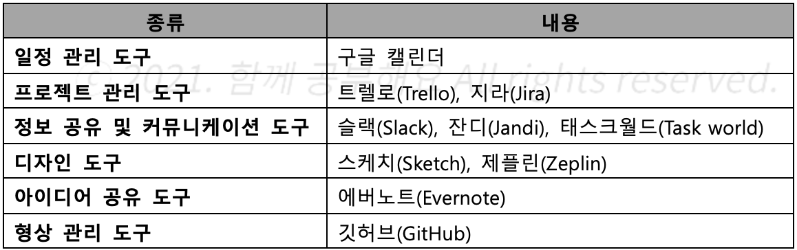

## 소프트웨어 패키징 ⭐️

### 개요

- 모듈별로 생성한 실행 파일들을 묶어 배포용 설치 파일을 만드는 것
- 개발자가 아닌 **사용자를 중심으로 진행**

### 고려사항

- 운영체제(OS), CPU, 메모리 등에 필요한 최소 환경을 정의
- 하드웨어와 함께 관리될 수 있도록 **Managed Service형태**로 제공
- **다양한 사용자의 요구사항 반영**

### 패키징 작업 순서

- 기능 **식**별 → **모**듈화 → **빌**드 진행 → 사용자 **환**경 분석 → **패**키징 및 적용 시험 → 패키징 **변**경 개선 → 배포

### 제품 소프트웨어 패키징 도구 활용 시 고려사항 (기출)

- 패키징 시 사용자에게 배포되는 SW이므로 **보안 고려**
- 사용자 편의성을 위한 **복잡성 및 비효율성 문제 고려**
- 제품 SW종류에 적합한 **암호화 알고리즘 적용**
- **다양한 기종 연동 고려**

## Release Note

### 개요

- 개발 과정에서 정리된 릴리즈 정보를 소프트웨어의 고객과 **공유하기 위한 문서**
- **개선된 작업이 있을 때마다 관련 내용을 릴리즈 노트에 담아 제공**
- 개발팀에서 제공하는 소프트웨어 사양에 대한 최종 승인을 얻은 후 문서화되어 제공

### 초기 버전 작성 시 고려 사항

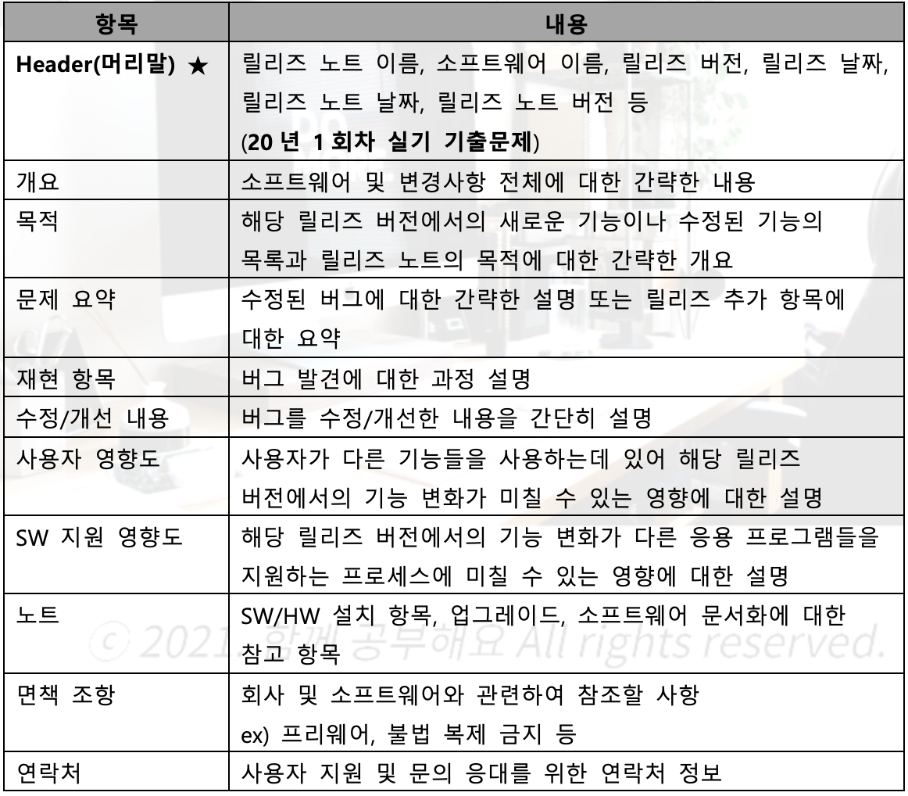

### 추가 버전 작성 시 고려사항

- 베타 버전이 출시되거나 긴급한 버그 수정, 업그레이드와 같은 자체 기능 향상, 사용자 요청 등의 특수한 상황이 발생하는 경우 추가로 작성
- 버그 번호를 포함한 **모든 수정된 내용을 담아 릴리즈 노트 작성**
- 추가나 수정된 경우 **자체 기능 향상과는 다른 별도의 릴리즈 버전 출시**하고 릴리즈 노트 작성

### 릴리즈 노트 작성 순서

- 모듈 **식**별 → 릴리즈 **정**보 확인 → 릴리즈 노트 **개**요 작성 → **영**향도 체크 → **정**식 릴리즈 노트 작성 → **추**가 개선 항목 식별

## 디지털 저작권 관리 ⭐️⭐️

- 디지털 콘텐츠의 전 과정에 걸쳐 사용되는 디지털 콘텐츠 관리 및 보호 기술

### 디지털 저작권 관리(DRM; Digital Right Management)의 흐름 ⭐️

- **콘**텐츠 제공자(Contents Provider): 콘텐츠를 **제공**하는 저작권자
- 콘텐츠 분배자(Contents Provider): 암호화된 콘텐츠를 **유통**하는 곳이나 사람
- 콘텐츠 소비자(Customer): 콘텐츠를 구매해서 **사용하는 주체**
- **P**ackager: 콘텐츠를 메타 데이터와 함께 **배포 가능한 형태로 묶어 암호화하는 프로그램**
- **C**learing House: 저작권에 대한 **사용 권한**, **라이선스 발급**, 사용량에 따른 **결제관리** 등을 수행하는 곳
- DRM **C**ontroller: 배포된 콘텐츠의 **이용 권한을 통제**하는 프로그램
- **보**안 컨테이너(Security Container): 콘텐츠 원본을 안전하게 유통하기 위한 **전자적 보안 장치**

### 디지털 저작권 관리의 기술 요소 ⭐️

- **암**호화(Encryption): 콘텐츠 및 라이선스를 **암호화하고 전자서명**을 할 수 있는 기술
- **키** 관리(Key Management): 콘텐츠를 **암호화한 키에 대한 저장 및 분배** 기술
- **식**별 기술(Identification): 콘텐츠에 대한 **식별 체계 표현** 기술
- **저**작권 표현(Right Expression): **라이선스의 내용 표현** 기술
- 암호화 **파**일 생성(Packager): 콘텐츠를 **암호화된 콘텐츠로 생성**하기 위한 기술
- **정**책 관리(Policy Management): 라이선스 발급 및 사용에 대한 **정책 표현** 및 관리 기술
- **크**랙 방지(Tamper Resistance): **크랙**에 의한 콘텐츠 사용 방지 기술
- **인**증(Authentication): 라이선스 발급 및 사용의 기준이 되는 사용자 **인증 기술**

## 형상 관리 ⭐️⭐️

### 소프트웨어 패키징의 형상 관리(SCM; Software Configuration Management)

- 형상 관리는 소프트웨어의 **개발 과정에서 소프트웨어의 변경 사항을 관리**하기 위해 개발된 일련의 활동
- 소프트웨어 **개발의 전 단계에 적용되는 활동**이며, 유지보수 단계에서도 수행

### 형상 관리의 중요성

- 소프트웨어의 **변경 사항을 체계적으로 추적하고 통제**할 수 있음
- 제품 소프트웨어에 대한 **무절제한 변경 방지**
- 진행 정도를 확인하기 위한 기준으로 사용될 수 있음

### 형상 관리 기능

- 형상 **식**별: 형상 관리 대상에 이름과 관리 번호를 부여하고, 계층(Tree) 구조로 **구분하여 수정 및 추적이 용이하도록 하는 작업**
- 형상 **통**제(변경 관리): **식별된 형상 항목에 대한 변경 요구를 검토**하여 현재의 기준선(베이스 라인, Base line)이 잘 반영될 수 있도록 조정하는 작업
- 형상 **감**사: **기준선(베이스 라인)의 무결성을 평가**하기 위해 확인, 검증, 검열 과정을 통해 공식적으로 승인하는 작업
- 형상 **기**록(상태 보고): 형상의 식별, 통제, 감사 **작업의 결과를 기록, 관리하고 보고서를 작성하는 작업**
- 버전 제어: 소프트웨어 업그레이드나 유지 보수 과정에서 생성된 다른 버전의 형상 항목을 관리하고, 이를 위해 특정 절차와 도구(Tool)를 결합시키는 작업

### 소프트웨어 버전 등록 관련 주요 용어

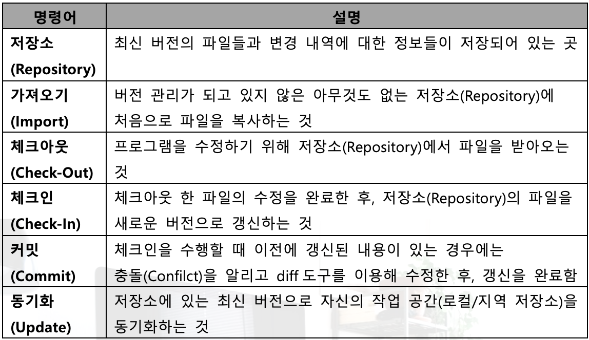

### 소프트웨어 버전 등록 과정

- 가져오기(**Im**port) → 인출(**Che**ck-Out) → 예치(**Com**mit) → 동기화(**Up**date) → 차이(**Di**ff)

### 제품 소프트웨어의 형상 관리 역할 (기출)

- 형상 관리를 통해 이전 리비전이나 버전에 대한 정보에 접근 가능하여 **배포본 관리에 유용**
- 불필요한 사용자의 **소스 수정 제한**
- 동일한 프로젝트에 대해 **여러 개발자 동시 개발 가능**

## 버전 관리 도구 ⭐️⭐️

### 공유 폴더 방식

- 버전 관리 자료가 **로컬 컴퓨터의 공유 폴더에 저장되어 관리**되는 방식
- 개발자들은 개발이 완료된 파일을 **약속된 공유 폴더에 매일 복사**함
- 담당자는 **공유 폴더의 파일을 자기 PC로 복사**해 컴파일 한 후 이상 유무 확인
- 파일의 변경 사항을 데이터베이스에 기록하며 관리
  ex) SCCS, RCS, PVCS, QVCS

### Client/Server 방식

- 버전 관리 자료가 **중앙 시스템(서버)에 저장**되어 관리되는 방식
- 서버의 자료를 **개발자별로 자신의 PC(클라이언트)로 복사**해 작업한 후 변경된 내용을 중앙 서버에 반영
- **모든 버전 관리는 서버에서 수행**됨
- 하나의 파일을 서로 다른 개발자가 작업할 경우 경고 메시지 출력
- **서버에 문제가 생기면 다른 개발자와의 협업 및 버전 관리 작업은 중단**됨
  ex) CVS, SVN(Subversion)

### 분산 저장소 방식

- **하나의 원격 저장소**와 **분산된 개발자 PC의 로컬 저장소**에 함께 저장되어 관리되는 방식
- 개발자별로 원격 저장소의 자료를 자신의 **로컬 저장소로 복사해 작업**한 후 변경 된 내용을 **로컬 저장소에서 우선 반영**(Commit)한 다음 이를 **원격 저장소에 반영**(Push)
- 원격 저장소에 **문제가 생겨도 로컬 저장소의 자료를 이용해 작업** 가능
- 로컬 저장소에서 작업을 수행할 수 있어 **처리속도가 빠름**
  ex) Git Bitkeeper

### SVN(Subversion)

- **CVS를 개선**한 것으로 Apache 소프트웨어 재단에서 2000년 발표함
- 모든 개발 작업은 trunk 디렉터리에서 수행되며, 추가 작업은 branches 디렉터리 안에 별도의 디렉터리를 만들어 작업을 완료한 후 trunk 디렉터리와 병합(merge)
- 커밋(Commit)할 때마다 리비전(Revision)이 1씩 증가
- 서버는 주로 **유닉스(UNIX)** 사용
- **오픈 소스**로 무료사용 가능
- CVS의 단점이었던 **파일이나 디렉터리의 이름 변경, 이동 등이 가능**
  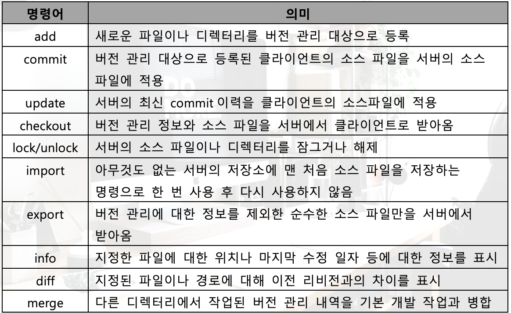

### Git ⭐️

- Linus Torvalds가 2005년 리눅스 커널 개발에 사용할 관리 도구로 개발한 이후 Junio Hamano에 의해 유지 보수되고 있음
- 원격 저장소는 **여러 사람들이 협업을 위해 버전을 공동 관리하는 곳**으로, 자신의 버전 관리 내역을 반영(Push)하거나 다른 개발자의 변경 내용을 가져올 때(Fetch) 사용
- 로컬 저장소는 **개발자들이 본인의 실제 개발을 진행하는 장소**로 버전 관리가 수행됨
- **Branch**를 이용하면 기본 버전 관리 틀에 영향을 주지 않으면서 **다양한 형태의 기능 테스팅 가능**
- 파일의 변화를 **스냅샷(Snapshot)**으로 저장
- 스냅샷은 이전 스냅샷의 포인터를 가지므로 **버전의 흐름 파악 가능**
  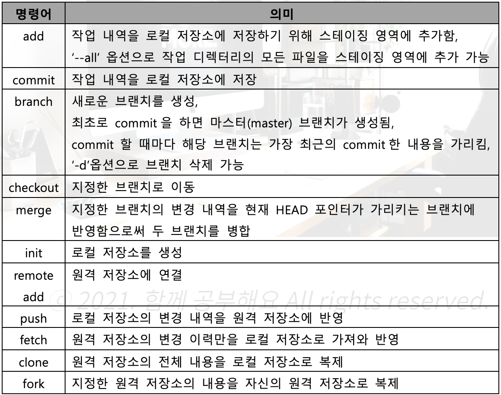

## 애플리케이션 테스트 ⭐️⭐️

### 개념

- 애플리케이션에 잠재되어 있는 **결함을 찾아내는 일련의 행위** 또는 절차
- 개발된 소프트웨어가 고객의 요구사항을 만족시키는지 **확인(Validation)**
- 소프트웨어가 기능을 정확히 수행하는지 **검증(Verification)**

### 애플리케이션 테스트의 기본 원리 ⭐️

  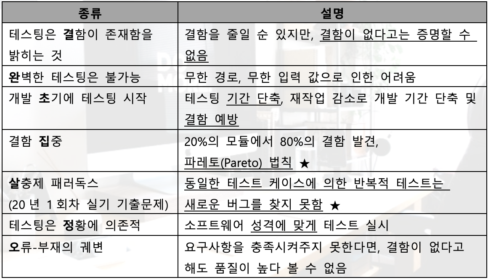

## 애플리케이션 테스트의 분류 ⭐️⭐️

### 프로그램 실행 여부에 따른 테스트

- 정적 테스트: **프로그램을 실행하지 않고** 명세서나 소스 코드를 대상으로 분석하는 테스트
  - 워크 스루, 인스펙션, 코드 검사
- 동적 테스트: **프로그램을 실행**하여 오류를 찾는 테스트
  - 화이트박스 테스트, 블랙박스 테스트

### 테스트 기반에 따른 테스트

- 명세 기반 테스트: 사용자의 요구사항에 대한 **명세를 빠짐없이 테스트 케이스로 만들어** 구현하고 있는지 확인하는 테스트
  - 동등 분할, 경계값 분석(블랙박스 테스트)
- 구조 기반 테스트: 소프트웨어 **내부의 논리 흐름**에 따라 테스트 케이스를 작성하고 확인하는 테스트
  - 구문 기반, 결정 기반, 조건 기반(화이트박스 테스트)
- 경험 기반 테스트: **테스터의 경험을 기반**으로 수행하는 테스트
  - 에러 추정, 체크 리스트, 탐색적 테스팅

### 시각에 따른 테스트

- 검증(Verification) 테스트: **개발자의 시각**에서 제품의 생산 과정을 테스트하는 것
  - 단위 테스트, 통합 테스트, 시스템 테스트
- 확인(Validation) 테스트: **사용자의 시각**에서 생산된 제품의 결과를 테스트하는 것
  - 인수 테스트(알파 테스트, 베타 테스트) (기출)

### 목적에 따른 테스트

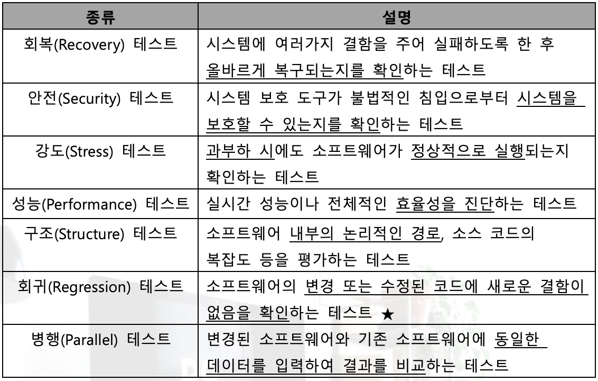

### 테스트 커버리지 유형

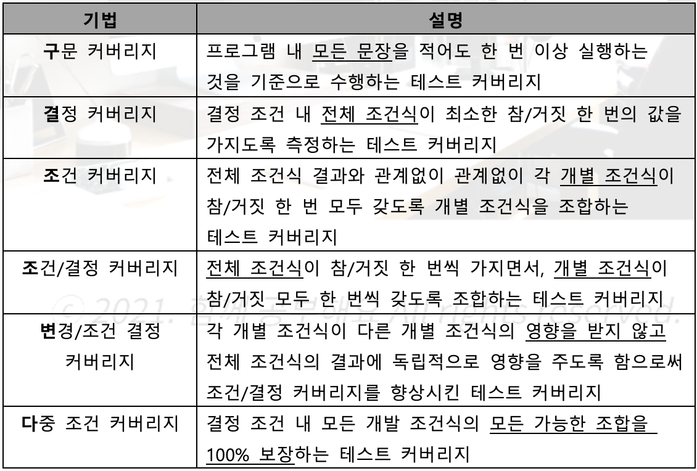

## 화이트박스 테스트, 블랙박스 테스트 ⭐️⭐️⭐️

### 화이트박스 테스트(White Box Test) (기출)

- 모듈 안의 내용(작동)을 직접 볼 수 있음
- **내부의 논리적인 모든 경로를 테스트**해 테스트 케이스를 설계
- 소스 코드(Source Code)의 **모든 문장을 한번 이상 수행**함으로써 진행됨
- 선택, 반복 등의 부분들을 수행함으로써 **논리적 경로 점검**
  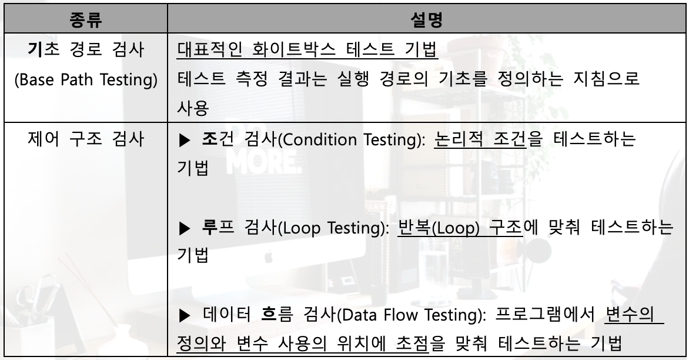

### 블랙 테스트(Black Box Test) (기출)

- 모듈 안에서 어떤 일(작동)이 일어나는지 알 수 없음
- 소프트웨어가 **수행할 특정 기능을 알기 위해 각 기능이 완전히 작동되는 것을 입증**하는 테스트로 기능 테스트라고도 함
- **소프트웨어 인터페이스에서 실시되는 테스트**
  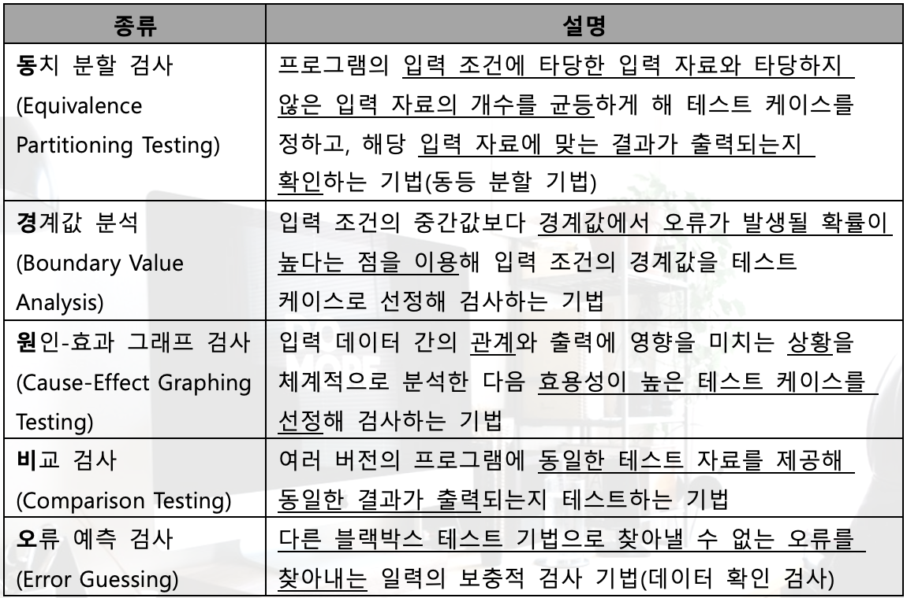

## 개발 단계에 따른 애플리케이션 테스트 ⭐️

### 단위 테스트(Unit Test)

- 코딩 직후 최소 단위인 **모듈이나 컴포넌트에 초점**을 맞춰 테스트 하는 것
- 사용자의 요구사항을 기반으로 한 기능성 테스트를 최우선으로 수행
- 명세 기반 테스트, 구조 기반 테스트 중 주로 **구조 기반 테스트를 시행함**

### 통합 테스트(Integration Test)

- 단위 테스트가 완료된 모듈들을 결합하여 하나의 시스템으로 완성시키는 과정에서의 테스트를 의미
- 모듈 간 또는 **통합된 컴포넌트 간**의 상호 작용 오류 검사
  - 빅뱅 테스트, 상향식 테스트(클러스터, Cluster/드라이버, Driver), 하향식 테스트(스텁, Stub)

### 시스템 테스트(System Test)

- 개발된 소프트웨어가 **컴퓨터 시스템에서 완벽하게 수행되는가를 점검하는 테스트**
- 실제 사용 환경과 유사하게 만든 테스트 환경에서 테스트 수행해야 함
- 기능적 요구사항(블랙박스 테스트), 비기능적 요구사항(화이트박스 테스트) 구분

### 인수 테스트(Acceptance Test) ⭐️

- 개발한 소프트웨어가 **사용자의 요구사항을 충족하는지에 중점**을 두는 테스트
  

## 통합 테스트 ⭐️⭐️

### 상향식 통합 테스트(Bottom Up Integration Test)

- 프로그램의 **하위 모듈에서 상위 모듈 방향으로 통합**하면서 테스트하는 기법
- 하나의 주요 제어 모듈과 관련된 종속 모듈의 그룹인 **클러스터**(Cluster) 필요
  - 하위 모듈들을 **클러스터**(Cluster)로 결합 → 더미 모듈인 **드라이버**(Driver) 작성 → 통합된 **클러스터 단위로 테스트** → 테스트 완료 후 **클러스터는 프로그램 구조의 상위로 이동해 결합**하고 **드라이버는 실제 모듈로 대체**됨 ⭐️

### 하향식 통합 테스트(Top Down Integration Test) (기출)

- 프로그램의 **상위 모듈에서 하위 모듈 방향으로 통합**하면서 테스트하는 기법
- **깊이 우선** 통합법, **넓이 우선** 통합법 사용
- 테스트 **초기부터 사용자에게 시스템 구조를 보여줄 수 있음**
- 상위 모듈에서는 테스트 케이스 사용하기 어려움
  - 주요 제어 모듈은 작성된 프로그램을 사용, 주요 제어 모듈의 종속 모듈은 **스텁**(Stub)으로 대체 → **깊이 우선 또는 넓이 우선 등의 통합 방식**에 따라 하위 모듈인 스텁(Stub)들이 한 번에 하나씩 실제 모듈로 교체됨 → 모듈이 통합될 때마다 테스트 실시 → 새로운 오류가 발생하지 않음을 보증하기 위해 **회귀 테스트 실시**

### 혼합식 통합 테스트

- 하위 수준에서는 상향식 통합, 상위 수준에서는 하향식 통합을 사용해 최적의 테스트를 지원하는 방식
- 샌드위치(Sandwich)식 통합 테스트 방법

## 테스트 케이스 | 테스트 시나리오 | 테스트 오라클 | 테스트 하네스 ⭐️⭐️

### 테스트 케이스

- 구현된 소프트웨어가 사용자의 요구사항을 정확하게 준수했는지를 확인하기 위해 **설계된 입력 값, 실행 조건, 기대 결과 등으로 구성된 테스트 항목에 대한 명세서**
- 명세 기반 테스트(블랙박스 테스트)의 설계 산출물에 해당
- 미리 설계해두면 테스트 오류 방지 및 테스트 수행 자원의 낭비를 줄일 수 있음

### 테스트 시나리오

- 테스트 케이스를 적용하는 순서에 따라 **여러 개의 테스트 케이스들을 묶은 집합**
- 테스트 케이스들을 적용하는 구체적인 절차를 명세한 문서
- 작성 시 유의 사항
  - 시스템별, 모듈별, 항목별 등과 같이 **여러 개의 시나리오로 분리해 작성**
  - 사용자의 요구사항과 설계 문서 등을 토대로 작성

### 테스트 오라클

- 테스트 결과가 올바른지 판단하기 위해 사전에 정의된 참 값을 대입해 비교하는 활동
- 특징
  - 제한된 검증: 모든 테스트 케이스에 적용할 수 없음
  - 수학적 기법: 값을 수학적 기법을 이용해 구할 수 있음
  - 자동화 기능: 프로그램 실행, 결과 비교, 커버리지 측정 등을 자동화할 수 있음
    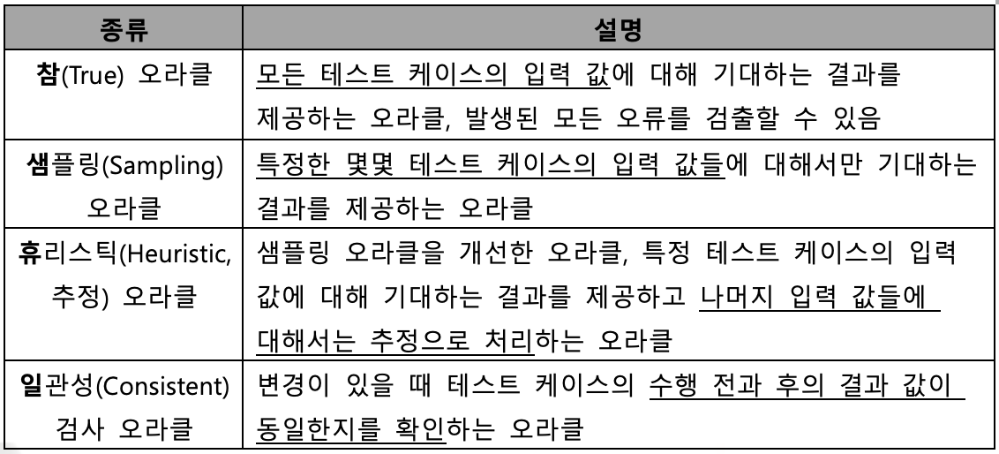

### 테스트 하네스 ⭐️

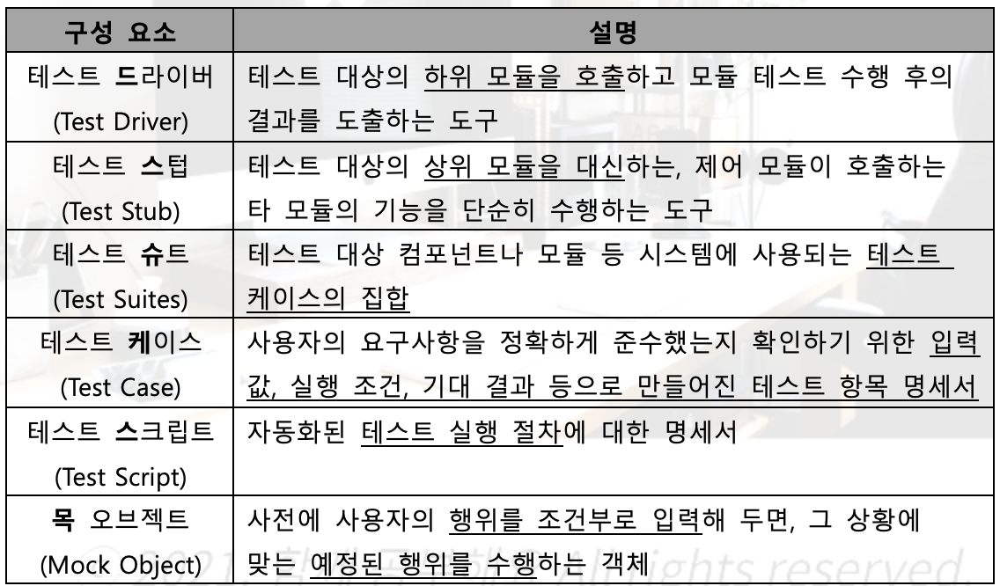

## 결함 관리 ⭐️

### 결함 상태 추적

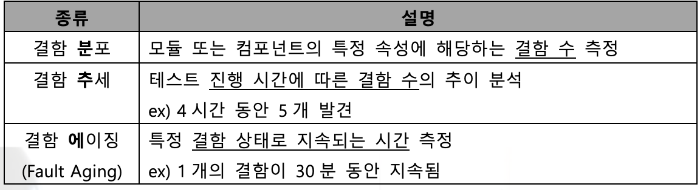

### 결함 추적 순서

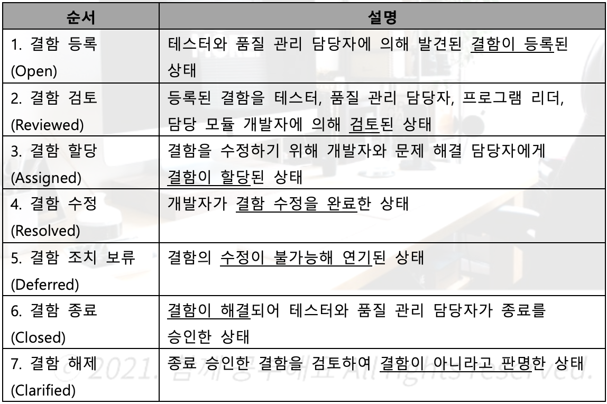

### 결함 심각도, 결함 우선순위

- 결함 심각도: 치명적(Critical) > 주요(Major) > 보통(Normal) > 경미(Minor) > 단순(Simple)
- 결함 우선순위: 치명적(Critical) > 높음(High) > 보통(Medium) > 낮음(Low)

## 애플리케이션 성능 분석 ⭐️⭐️

### 애플리케이션 성능 ⭐️⭐️ (기출)

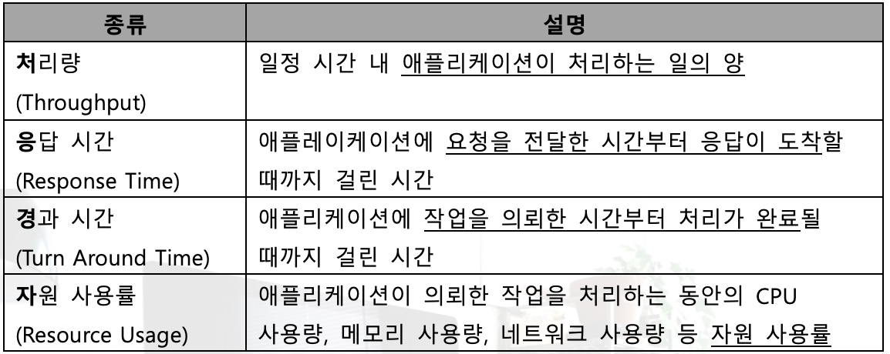

### 애플리케이션 성능 저하 원인 분석

- DB에 필요 이상의 많은 데이터를 요청한 경우
- **커넥션 풀(Connection Pool)의 크기를 너무 작거나 크게 설정**한 경우
- JDBC나 ODBC 같은 미들웨어를 사용한 후 **종료하지 않아 연결 누수**가 발생한 경우
- **대량의 파일을 업로드하거나 다운로드**해 처리 시간이 길어진 경우

### 소스 코드 최적화

- 클린 코드(Clean Code) 작성 원칙
- 가독성, 단순성, 의존성 배제, 중복성 최소화, 추상화

### 소스 코드 품질분석 도구의 종류 ⭐️ (기출)

- 정적 분석 도구: pmd, cppcheck, checkstyle, SonarQube, ccm, cobertuna
- 동적 분석 도구: Avalanche, Valgrind

## 모듈 연계

### EAI(Enterprize Application Integration) (기출)

- 기업 내 각종 애플리케이션 및 플랫폼 간의 **정보 전달, 연계, 통합 등 상호 연동이 가능하게 해주는 솔루션**
  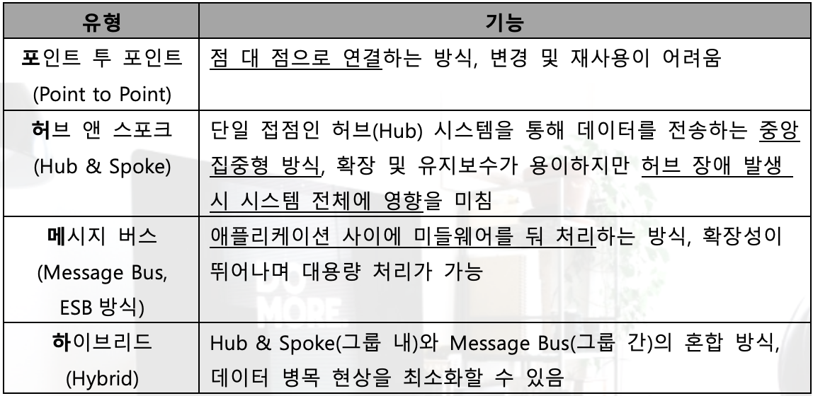

### ESB(Enterprize Service Bus)

- 애플리케이션 간 연계, 데이터 변환, 웹 서비스 지원 등 표준 기반의 인터페이스를 제공하는 솔루션
- 애플리케이션 통합 측면에서 EAI와 유사하지만 애플리케이션 보다는 **서비스 중심의 통합을 지향**
- **결합도(Coupling)를 약하게(Loosely)** 유지함
- 관리 및 보안 유지가 쉽고, 높은 수준의 품질 지원이 가능

## 인터페이스 구현 | 보안 ⭐️⭐️

### 데이터 통신을 이용한 인터페이스 구현 (기출)

- 애플리케이션 영역에서 인터페이스 형식에 맞춘 데이터 포맷을 인터페이스 대상으로 전송하고 이를 수신 측에서 파싱(Parsing)해 해석하는 방식
- 주로 JSON이나 XML형식의 데이터 포맷을 사용해 인터페이스를 구현
  - **JSON**(JavaScript Object Notation): **속성-값**(Attribute-Value Pairs)으로 이뤄진 데이터 객체를 전달하기 위해 사람이 읽을 수 있는 텍스트를 사용하는 개방형 표준 포맷 ⭐️
  - **XML**(eXtensible Markup Language): 특수한 목적을 갖는 마크업 언어를 만드는 데 사용되는 다목적 마크업 언어, 웹 페이지의 기본 형식인 HTML의 문법이 각 웹 브라우저에서 상호 호환적이지 못하다는 문제와 **SGML(Stand Generalized Markup Language)의 복잡함을 해결하기 위해 개발됨** ⭐️

### 인터페이스 엔터티를 이용한 인터페이스 구현

- 인터페이스가 필요한 시스템 사이에 **별도의 인터페이스 엔터티로 상호 연계하는 방식**
- 일반적으로 **인터페이스 테이블을 엔터티로 활용**
- 송, 수신 인터페이스 테이블의 구조는 **상황에 따라 서로 다르게 설계**할 수도 있음

### 인터페이스 보안 기능 적용

- 네트워크(Network), 애플리케이션(Application), 데이터베이스(Database) 영역
- 스니핑(Sniffing): 네트워크의 **중간에서 남의 패킷 정보를 도청**하는 해킹 유형
- 소프트웨어 개발 보안(**Secure Coding**): 소프트웨어 개발 과정에서 지켜야 할 일련의 보안 활동 ★
  ex) 입력 데이터 검증 표현, 보안 기능, 시간 및 상태, 에러 처리, 코드 오류, 캡슐화, API 오용

## 인터페이스 구현 검증 | 오류 확인 ⭐️⭐️

### 인터페이스 구현 검증 도구 ⭐️ (기출)

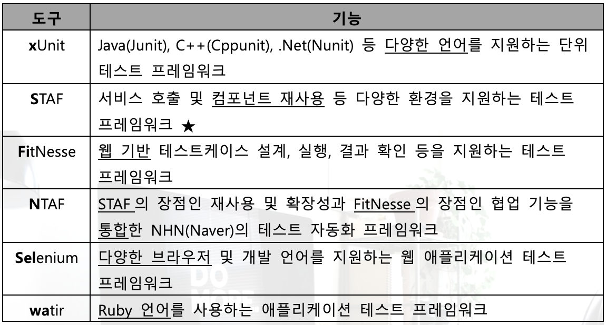

### 인터페이스 오류 발생 즉시 확인

- 오류 메시지 알람 표시, 오류 SMS 발송, 오류 내역 이메일 발송

### 인터페이스 오류 발생 주기적인 확인

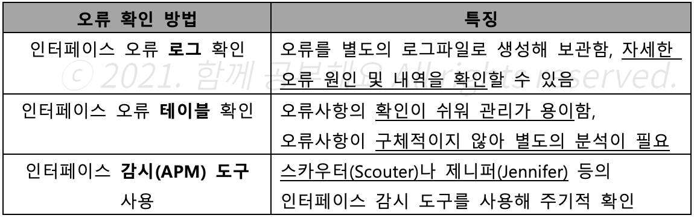

## 추가 정리 및 기출문제 ⭐️⭐️⭐️

### 트리 순회 방법

   
- 전위 순회(Pre-Order Traversal): Root → Left → Right
- 중위 순회(In-Order Traversal): Left → Root → Right
- 후위 순회(Post-Order Traversal): Left → Right → Root

### 이진 트리

- Degree(차수)가 2 이하인 노드로 구성돼 자식이 둘 이하로 구성된 트리
  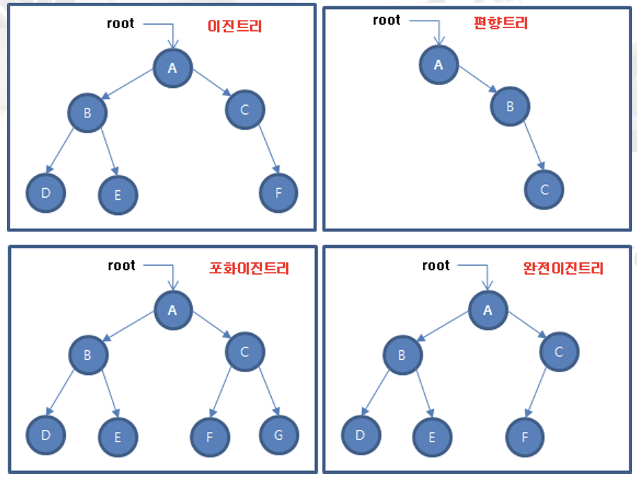

### 논리 데이터 저장소

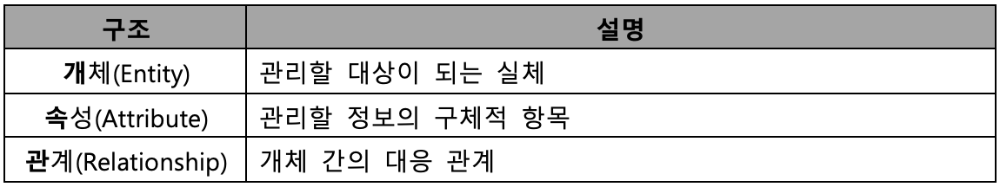

### 물리 데이터 저장소

- 논리 데이터 저장소에서 물리 데이터 저장소 모델로 변환하는 절차
  - **단위 개체**를 **테이블**로 변환 → **속성**을 **컬럼**으로 변환 → **UID**(Unique Identifier)를 **기본 키**(Primary Key)로 변환 → **관계**를 **외래 키**(Foreign Key)로 변환 → 컬럼 유형(Type)과 길이(Length) 정의 → **반정규화**(De-normalization) 수행

### Index

- **분포도(Selectivity) 10~15%** 이내
- Index Column 선정
  - **수정이 빈번하지 않는 column**
  - **ORDER BY, GROUP BY, UNION이 빈번한 column**
  - **분포도가 좋은 column**은 **단독 인덱스**로 생성
  - **인덱스들이 자주 조합**되어 사용되는 column은 **결합 인덱스**로 생성
- 설계 시 고려사항
  - **지나치게 많은 인덱스는 오버헤드(Overhead)** 발생
  - **인덱스만의 추가적인 저장 공간**이 필요
  - 넓은 범위 인덱스 처리 시 오히려 전체 처리보다 많은 오버헤드를 발생시킴

### View(뷰)

- **기본 테이블로부터 유도된**, 이름을 가지는 \**가상 테이블*로 기본 테이블과 같은 형태의 구조를 사용하며, 조작도 기본 테이블과 거의 같음
- **가상 테이블**이기 때문에 물리적으로 구현되어 있지 않지만 사용자에게 있는 것처럼 간주됨
- 데이터의 **논리적 독립성을 제공**할 수 있음
- **정의된 뷰로 다른 뷰를 정의**할 수 있음
- 뷰가 정의된 기본 테이블이나 뷰를 삭제하면 그 테이블이나 뷰를 기초로 정의된 **다른 뷰도 자동으로 삭제**됨
  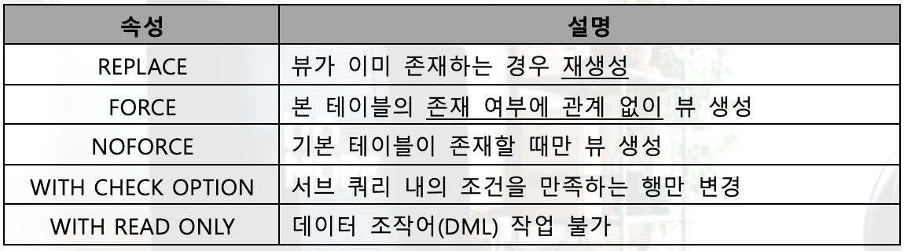

- 장점
  - **논리적 데이터 독립성 제공**
  - 접근 제어를 통한 **자동 보안 제공**
- 단점
  - **독립적인 인덱스를 가질 수 없음**
  - 뷰의 정의를 **ALTER로 변경할 수 없음** → **DROP하고 새로 CREATE해야 함**
  - 뷰로 구성된 내용에 대한 **삽입, 삭제, 갱신, 연산에 제약**이 따름

### Cluster

- 인덱스의 단점을 해결한 기법 → **분포도(Selectivity)가 넓을수록 오히려 유리**함
- **분포도가 넓은 “테이블”** 의 클러스터링은 **저장 공간의 절약이 가능**
- **대량의 범위**를 자주 액세스(조회)하는 경우 적용
- 인덱스를 사용한 처리 부담이 되는 **넓은 분포도**에 활용

#### 클러스터 테이블 선정

- **수정이 빈번하지 않는 “테이블”**
- **ORDER BY, GROUP BY, UNION이 빈번한 “테이블”**
- **처리 범위가 넓어** 문제가 발생하는 경우 **단일 테이블 클러스터링**
- **조인이 많아** 문제가 발생되는 경우는 **다중 테이블 클러스터링**

#### 설계 시 고려사항

- **조회 속도를 향상**시켜주지만 **입력, 수정, 삭제 시 성능이 저하됨(부하가 증가)**

### Partition

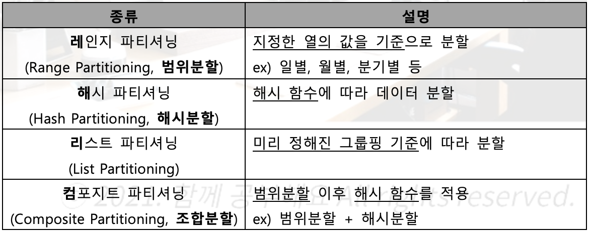

#### 장점

- 성능 향상, 가용성 향상, 백업 가능, 경합 감소

### PL/SQL

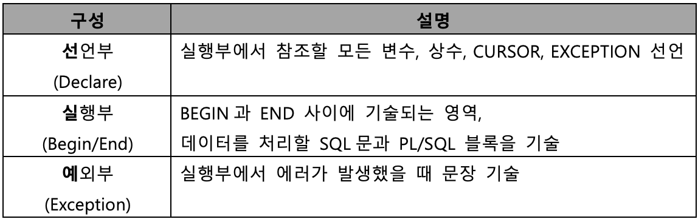

#### 장점

- 컴파일 불필요, 모듈화 기능, 절차적 언어 사용, 에러 처리

#### PL/SQL을 활용한 저장형 객체 활용

- 저장된 프로시저, 저장된 함수, 저장된 패키지, 트리거(Trigger)

### 단위 모듈 구현의 원리

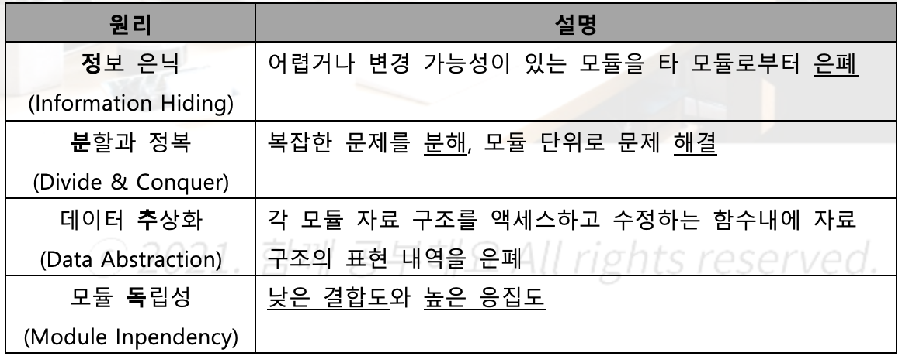

### 알고리즘 설계 기법 ⭐️

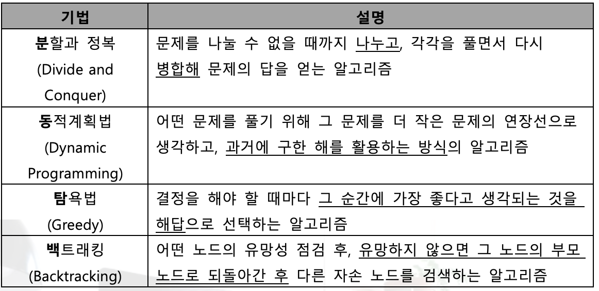

### 시간 복잡도에 따른 알고리즘 ⭐️⭐️

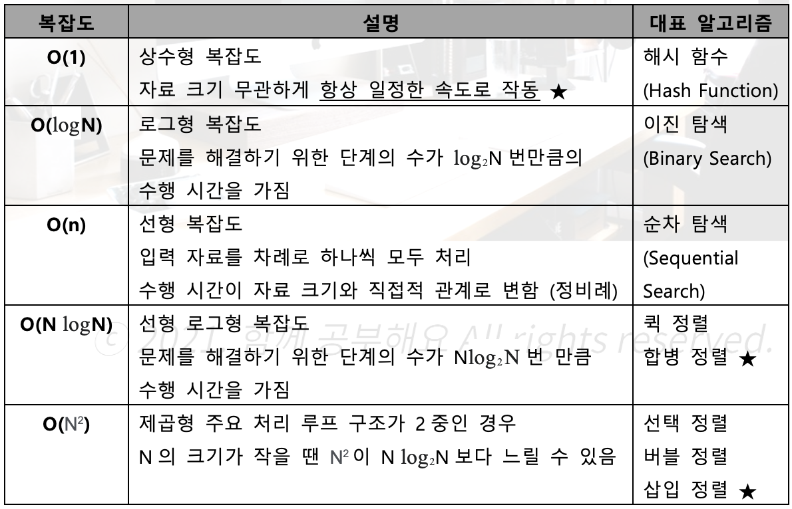

### SW SW 품질 측정을 위해 개발자 관점에서 고려해야 할 항목문제

- 정확성, 무결성, 사용성 (O) / 간결성 (X)

### 인터페이스 보안을 위해 네트워크 영역에 적용되는 솔루션

- IPSec, SSL, S-HTTP

### IPC(Inter-Process Communication)

- 모듈 간 통신 방식을 구현하기 위해 사용되는 **대표적인 프로그래밍 인터페이스 집합**으로, 복수의 프로세스를 수행하며 이뤄지는 **프로세스 간 통신까지 구현 가능**
  

### 정렬 알고리즘 ⭐️

`37, 14, 17, 40 ,35`

#### 선택 정렬, PASS 3 (3회전)

- PASS 1 ▶ 37, 14, 17, 40, 35 → 14, 37, 17, 40, 35
  1번째 37를 제외한 14, 17, 40, 35 중 **가장 작은 수(14)**와 37을 선택해서 바꿈
- PASS 2 ▶ 14, 37, 17, 40, 35 → 14, 17, 37, 40, 35
  1, 2번째 14, 37를 제외한 17, 40, 35 중 **가장 작은 수(17)**와 37을 선택해서 바꿈
- PASS 3 ▶ 14, 17, 37, 40, 35 → 14, 17, 35, 40, 37 (정답)
  1, 2, 3번째 14, 17, 37를 제외한 40, 35 중 **가장 작은 수(35)**와 37을 선택해서 바꿈

#### 버블 정렬, PASS 1 (1회전)

- PASS 1 ▶ 37, 14, 17, 40, 35 → 14, 37, 17, 40, 35
  1번째 37와 2번째 14를 비교해서 **1번째(37) > 2번째(14)**가 참이라면 바꿈

  - 14, 37, 17, 40, 35 → 14, 17, 37, 40, 35 (정답)

  2번째 37와 3번째 17를 비교해서 **2번째(37) > 3번째(17)**가 참이라면 바꿈
  3번째 37와 4번째 40을 비교해서 **3번째(37) > 4번째(40)**가 거짓이므로 종료(끝)

#### 삽입 정렬, PASS 4 (4회전)

- PASS 1 ▶ 37, 14, 17, 40, 35 → 14, 37, 17, 40, 35
  2번째 14를 앞의 1번째 37과 비교해서 **수가 더 작다면 바꿔 삽입**함
- PASS 2 ▶ 14, 37, 17, 40, 35 → 14, 17, 37, 40, 35
  3번째 17을 앞의 2번째 37, 1번째 14와 비교해서 **수가 더 작다면 바꿔 삽입**함
- PASS 3 ▶ 14, 17, 37, 40, 35
  4번째 40을 앞의 3번째 37, 2번째 17, 1번째 14 비교해서 **수가 더 작다면 바꿔 삽입**함
- PASS 4 ▶ 14, 17, 37, 40, 35 → 14, 17, 35, 37, 40 (정답)
  5번째 35를 앞의 4번째 40, 3번째 37, 2번째 17, 1번째 14와 비교해서 **수가 더 작다면 바꿔 삽입**함

### McCabe의 cyclomatic 수

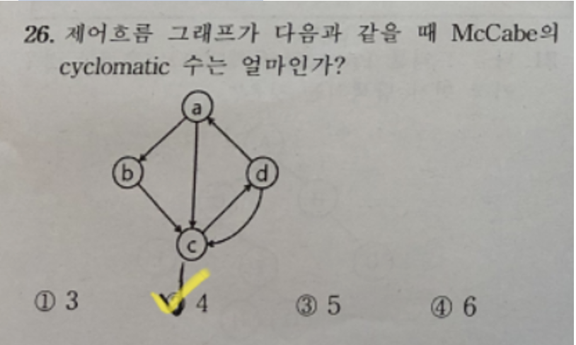

- Edge(선) – Node(점) + 2 = 6 – 4(a, b, c, d) + 2 = 4

### 소프트웨어 재공학이 소프트웨어 재개발에 비해 갖는 장점

- 위험부담 감소, 비용 절감, 시스템 명세의 오류억제, 개발시간의 감소

### 소프트웨어 품질 목표

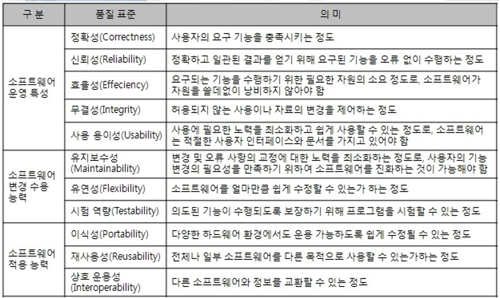

### 소프트웨어 공학의 기본 원칙

- 품질 높은 소프트웨어 상품 개발
- 지속적인 검증 시행
- 결과에 대한 명확한 기록 유지

### AJAX(Asynchronous JavaScript and XML) ⭐️⭐️

- **JavaScript를 사용한 비동기 통신기술**로 **클라이언트와 서버 간에 XML 데이터를 주고 받는 기술**

### 외부 스키마, 내부 스키마, 개념 스키마

- 외부 스키마(External Schema): **사용자의 관점**에서 보여주는 데이터베이스 구조로 전체 데이터베이스의 일부이므로 서브 스키마로고도 함
- 내부 스키마(Internal Schema): **저장장치의 입장**에서 데이터베이스 전체가 저장되는 방법을 명세한 것으로 단 하나만 존재함
- 개념 스키마(Conceptual Schema): 전체 사용자 또는 모든 응용 시스템이 필요한 데이터베이스 구조로 **조직 전체**의 데이터베이스로 단 하나만 존재함

### 해싱 함수

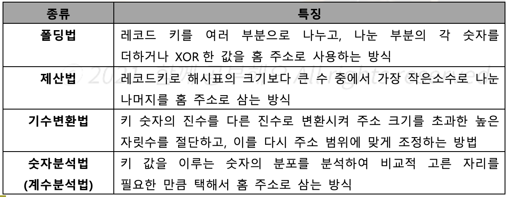
