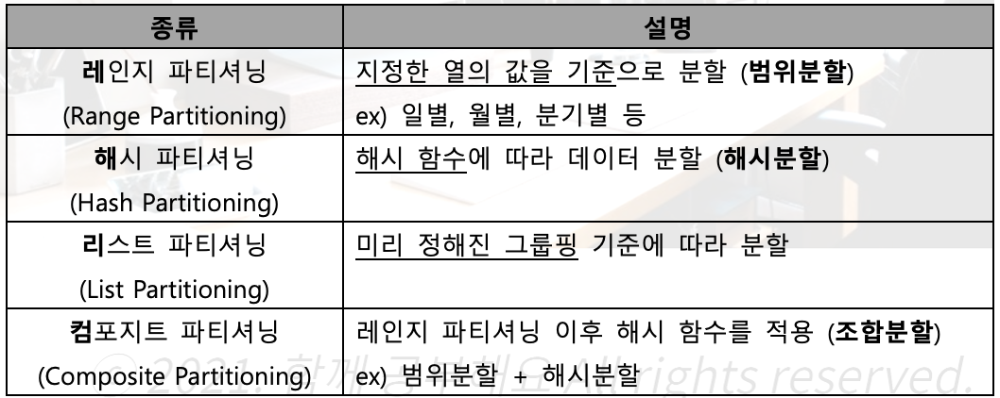

# 데이터 베이스 구축

## 데이터 베이스 설계

- 무결성, 일관성, 회복, 보안, 효율성, 데이터베이스 확장

### 데이터베이스 설계 순서


## 데이터 모델

### 데이터 모델 의 구성 요소

- 개체(Entity): 데이터베이스에 표현하려는 것으로 **사람이 생각하는 개념이나 정보 단위** 같은 현실 세계의 대상체
- 속성(Attribute): **데이터의 가장 작은 논리적 단위**로서 파일 구조상의 데이터 항목 또는 데이터 필드에 해당
- 관계(Relationship): 개체 간의 관계 또는 속성 간의 논리적인 연결을 의미

### 개념적 데이터 모델

- 현실 세계에 대한 인간의 이해를 돕기 위해 현실 세계에 대한 인식을 추상적 개념으로 표현하는 과정
  ex) E-R(Entity-Relation) 모델

### 논리적 데이터 모델

- 개념적 모델링 과정에서 얻은 개념적 구조를 컴퓨터가 이해하고 처리할 수 있는 **컴퓨터 세계의 환경에 맞도록 변환**하는 과정
- 단순히 데이터 모델이라고 하면 논리적 데이터 모델을 의미
  ex) 관계 모델, 계층 모델, 네트워크 모델

### 데이터 모델에 표시할 요소

- 구조(Structure): 논리적인 개체 타입들 간의 관계, 데이터 구조 및 정적 성질을 표현
- 연산(Operation): 실제 데이터를 처리하는 작업에 대한 명세로, 조작하는 기본 도구
- 제약 조건(Constraint): DB에 저장될 수 있는 실제 데이터의 논리적인 제약 조건

## 개체(Entity) ⭐️

### 정의 및 특징

- 실세계에 독립적으로 존재하는 **유형, 무형의 정보**로 서로 연관된 몇 개의 속성으로 구성됨
- 데이터베이스에 표현하려는 것으로 **사람이 생각하는 개념이나 정보 단위** 같은 현실 세계의 대상체
- 독립적으로 존재하거나 그 **자체로서도 구별 가능**
- **유일한 식별자**(Unique Identifier)에 의해 식별 가능
- 다른 개체와 하나 이상의 관계(Relationship)가 있음

### 개체 선정 방법

- 실제 업무를 담당하고 있는 **담당자와 인터뷰**를 함
- 실제 업무에 사용되고 있는 **장부와 전표**를 이용
- **자료 흐름도(DFD; Data Flow Diagram)**를 통해 업무 분석을 수행했을 경우 자료 흐름도의 **자료 저장소(Data Store)** 를 이용함
- **BPR**(Business Process Reengineering, 업무 프로세스 재설계)에 의해 업무를 재정의한 경우 관련 개체를 찾음

### 개체명 지정 방법

- 일반적으로 해당 **업무에서 사용하는 용어**로 지정
- **약어 사용은 되도록 제한**
- 가능하면 **단수 명사** 사용
- 모든 **개체명은 유일**해야 함
- 가능하면 개체가 생성되는 의미에 따라 이름 부여
  ex) 교수, 고객, 주문, 도시

## 속성(Attribute) ⭐️

- 데이터베이스를 구성하는 **가장 작은 논리적 단위**
- 파일 구조상의 **데이터 항목 또는 데이터 필드**
- 개체를 **구성하는 항목** 및 **개체의 특성**을 기술
- 속성의 수를 **디그리(Degree) 또는 차수**라고 함 ⭐️
  cf) **튜플**(Tuple)의 수는 **카디널리티(Cardinality)** ⭐️

### 속성의 특성에 따른 분류


### 개체 구성 방식에 다른 분류


### 속성명 지정 원칙

- 해당 업무에서 사용하는 용어 지정
- 서술형으로 지정하지 않음
- 가급적 약어의 사용은 제한
- 개체명은 속성명으로 사용할 수 없음
- 개체에서 유일하게 식별 가능하도록 지정

## 관계(Relationship) ⭐️

### 형태


- 일 대 일(1:1): 개체 집합 A의 각 원소가 개체 집합 B의 원소 **한 개와 대응**하는 관계
- 일 대 다(1:N): 개체 집합 A의 각 원소는 개체 집합 B의 원소 여러 개와 대응하고 있지만, 개체 집합 B의 각 원소는 개체 집합 A의 원소 **한 개와 대응**하는 관계
- 다 대 다(N:M): 개체 집합 A의 각 원소는 개체 집합 B의 원소 여러 개와 대응하고, 개체 집합 B의 각 원소도 개체 집합 A의 원소 **여러 개와 대응**하는 관계

### 관계의 종류

- **종**속(Dependant) **관**계, **중**복(Redundant) 관계, \***\*재**귀(Recursive) 관계, **배**타(Exclusive) 관계

## 식별자(Identifier) ⭐️

- 하나의 개체 내에서 각각의 **인스턴스를 유일(Unique)하게 구분**할 수 있는 구분자
- 모든 개체는 **한 개 이상의 식별자**를 반드시 가져야 함
  

## E-R(개체-관계) 모델 ⭐️⭐️

### 개요

- **개념적 데이터 모델**의 가장 대표적인 것
- 1976년 피터 첸(Peter Chen)에 의해 제안되고 기본적인 구성 요소가 정립됨
- 데이터를 **개**체(Entity), **속**성(Attribute), **관**계(Relationship)으로 묘사
- 특정 DBMS를 고려한 것은 아님
- E-R 다이어그램으로 **1:1, 1:N, N:M** 등의 관계 유형을 제한 없이 나타냄

### 피터 첸 표기법 ⭐️


### 정보 공학 표기법(Information Engineering Notation, 크로우즈 핏)

- 1981년 클리프 핀켈쉬타인(Clive Finkelstein)과 제임스 마틴(James Maritn)이 공동 개발
  
  
- 실선은 1개를 의미, 까마귀 발은 N개를 의미함
- 원형 표시는 선택적 의미를 지니는데 **관계가 있을 수도, 없을 수도 있다**는 것

### 바커 표기법(Barker Notation)

- 영국 컨설팅 회사 CACI에서 개발, 리차드 바커(Richard Barker)에 의해 정립
  
  

## 관계형 데이터 모델 ⭐️⭐️

### 개요 ⭐️

- 2차원적인 **표(Table)를 이용**해 데이터 상호 관계를 정의하는 DB 구조
- **기본 키(Primary Key)** 와 이를 참조하는 **외래 키(Foreign Key)** 로 데이터 간의 관계를 표현
- 계층 모델과 망 모델의 복잡한 구조를 단순화시킨 모델
- 관계형 모델의 대표적인 언어는 **SQL**이고 **1:1, 1:N, N:M 관계** 를 자유롭게 표현

### 관계형 데이터 모델(Relational Data Model)의 구성


- <고객> 테이블에 있는 ‘고객번호’와 <주문서>테이블에 있는 ‘주문번호’는 “기본 키”
- <주문> 테이블에 있는 ‘고객번호’, ‘주문번호’는 기본 키를 참조하고 있는 “외래 키”
- <고객> 테이블과 <주문> 테이블의 관계는 1:N
  - 한 명의 고객은 여러 개의 주문을 신청할 수 있음
- <주문서> 테이블과 <주문> 테이블의 관계는 1:1
  - 주문서는 주문번호 1개에 대한 정보만을 가짐

## 관계형 데이터베이스의 구조 ⭐️⭐️

### 구조 ⭐️⭐️

- 1970년 IBM에 근무하던 코드(E. F. Codd)에 의해 처음 제안됨
  
- 튜플(Tuple), 행(Row), 레코드(Record)

  - 속성의 모임으로 구성됨
  - 파일 구조상 레코드(실제 데이터)와 같은 의미
  - **튜플의 수** = **카디널리티(Cardinality)** 또는 기수, 대응수 ⭐️

- 속성(Attribute), 열(Column), 필드(Field)

  - 데이터베이스를 구성하는 **가장 작은 논리적 단위**
  - 파일 구조상의 **데이터 항목 또는 데이터 필드**에 해당
  - **개체의 특성**을 기술
    - **속성의 수** = **디그리(Degree)** 또는 **차수** ⭐️

- 도메인(Domain) ⭐️ (기출)
  - 하나의 속성(Attribute, 애트리뷰트)이 가질 수 있는 같은 타입 원자(Atomic)값들의 집합
    ex) 성별 속성(Attribute)의 도메인은 ‘남’, ‘여’로 그 외의 값은 입력될 수 없음(일반적)

## Relation의 특징 ⭐️ (기출)

- 한 relation(테이블)에 포함된 **tuple(행)들은 모두 상이**함, 즉 **서로 다른 값**을 갖음
- 한 relation(테이블)에 포함된 **tuple(행) 사이에는 순서가 없음**
- relation 스키마를 구성하는 **attribute(열) 간의 순서는 중요하지 않음**
- 각 **attribute는 식별을 위해 릴레이션 내에서 유일한 이름을 가짐**, 그러나 그에 해당하는 도메인(attribute를 구성하는 값)에는 동일한 값이 있을 수 있음
  ex) ‘학년’ 속성에는 1, 2, 3, 4 값이 중복될 수 있음
- attribute는 논리적으로 **더 이상 쪼갤 수 없는 원자 값**으로 저장함

### 정리

1. tuple은 서로 상이한 값을 갖고, 순서가 없다.
2. attribute는 원자 값을 가지고, 순서가 중요하지 않고, 유일한 이름을 가짐

## Key(키) ⭐️⭐️

- 데이터베이스에서 튜플들을 서로 구분할 수 있는 기준이 되는 속성(Attribute)

### 후보키(Candidate Key) ⭐️ (기출)

- 튜플을 유일하게 식별하기 위해 사용하는 **속성들의 부분집합**, 즉 기본키로 사용할 수 있는 속성들, 모든 릴레이션에는 **반드시 하나 이상의 후보키**가 존재
- 릴레이션에 있는 모든 튜플에 대해 **유일성과 최소성을 만족**시켜야 함 ⭐️

#### 유일성(Unique)

- 하나의 키 값으로 하나의 튜플만을 **유일하게 식별**할 수 있어야 함

#### 최소성(Minimality)

- 모든 레코드들을 유일하게 식별하는 데 **꼭 필요한 속성**으로만 구성되어야 함

### 기본키(Primary Key)

- 후보키 중에서 특별히 선정된 주키(Main Key)로, **중복된 값과 NULL값을 가질 수 없음**
- 후보키의 성질인 **유일성과 최소성을 가지며** 튜플을 식별하기 위해 반드시 필요한 키

### 대체키(Alternate Key)

- 후보키가 둘 이상일 때 **기본키를 제외한 나머지 후보키**를 의미

### 슈퍼키(Super Key) ⭐️

- 한 릴레이션 내에 있는 속성들의 집합으로 구성된 키
- 모든 튜플에 대해 유일성은 만족시키지만, **최소성은 만족시키지 못함**

### 외래키(Foreign Key) ⭐️ (기출)

- 다른 릴레이션의 기본키를 참조하는 속성 또는 속성들의 집합
- 참조되는 릴레이션의 기본키와 대응돼 **릴레이션 간의 참조 관계**를 표현

## 무결성(Integrity) ⭐️⭐️

- 데이터베이스에 저장된 데이터 값과 그것이 표현하는 **현실 세계의 실제 값이 일치하는 정확성**을 의미

### 개체 무결성(Entity Integrity, 실체 무결성) ⭐️ (기출)

- 테이블의 기본키를 구성하는 **어떤 속성(Attribute)도 널(NULL)값이나 중복 값을 가질 수 없음**
- 기본키의 **속성 값이 널(NULL)값이 아닌 원자 값을 갖는 성질**

### 도메인 무결성(Domain Integrity, 영역 무결성)

- relation 내의 튜플들이 각 속성(Attribute)의 **도메인에 지정된 값** 만을 가져야 함

### 참조 무결성(Referential Integrity) ⭐️

- 외래키 값은 NULL이거나 **참조 릴레이션의 기본키 값과 동일**해야 함
- 릴레이션은 **참조할 수 없는 외래키 값을 가질 수 없다는 규정**

### 사용자 정의 무결성(User-Defined Integrity)

- 속성 값들이 **사용자가 정의한 제약 조건**에 만족해야 함

### 데이터 무결성 강화

- 애플리케이션: 데이터 생성, 수정, 삭제 시 무결성 조건을 검증하는 코드를 데이터를 조작하는 **프로그램 내에 추가**
- 데이터베이스 트리거: **트리거 이벤트**에 무결성 조건을 실행하는 절차형 SQL을 추가
- 제약 조건: 데이터베이스에 **제약 조건을 설정**해 무결성을 유지

## 관계대수 및 관계 해석 ⭐️⭐️

### 관계 대수 ⭐️⭐️ (기출)

- 관계형 데이터 베이스에서 원하는 정보와 그 정보를 검색하기 위해서 **어떻게(How) 유도하는가를** 기술하는 **절차적 언어**
- 순수 관계 연산자
  
- 일반 집합 연산자
  

### 관계 해석

- 관계 데이터 모델의 제안자인 코드(E. F. Codd)가 **수학의 Predicate Calculus(술어 해석)에 기반**을 두고 관계 데이터베이스를 위해 제안
- 원하는 정보가 **무엇(What)** 이라는 것만 정의하는 **비 절차적 특성**
- **튜플 관계해석, 도메인 관계해석**
- 기본적으로 관계해석과 관계대수는 관계 **데이터베이스를 처리하는 기능과 능력면에서 동등**
- **관계 대수로 표현한 식은 관계 해석으로 표현**할수 있음
  

### 관계 대수와 관꼐 해석 비교


## 정규화(Normalization), 반정규화(Denormalization) ⭐️⭐️

- 하나의 종속성이 하나의 릴레이션에 표현될 수 있도록 분해해가는 과정
- 데이터베이스의 논리적 설계 단계에서 수행

### 정규화의 목적 ⭐️

- 데이터 구조의 **안정성 및 무결성**을 유지
- 어떠한 릴레이션이라도 **데이터베이스 내에서 표현 가능**하게 만듦
- **효과적인 검색 알고리즘 생성** 가능
- 데이터 **중복을 배제해 이상(Anomaly)의 발생 방지** 및 자료 저장 공간의 최소화
- 개체와 속성의 누락 여부 확인 가능
- 데이터 삽입 시 **relation을 재구성할 필요성을 줄임**

### 이상(anomaly)의 개념 및 종류 ⭐️

#### 개념

- 정규화를 거치지 않아 데이터베이스 내에 데이터들이 불필요하게 중복되어 릴레이션 조작 시 예기치 못하게 발생하는 곤란한 현상

#### 종류

- **삽**입 이상(Insertion Anomaly): 릴레이션에 데이터를 삽입할 때 **의도와 상관없이 원하지 않은 값들도 함께 삽입되는 현상**
- **삭**제 이상(Deletion Anomaly): 릴레이션에서 한 튜플을 삭제할 때 **의도와는 상관없는 값들도 함께 삭제되는 현상**
- **갱**신 이상(Update Anomaly): 릴레이션에서 튜플에 있는 **속성 값을 갱신할 때 일부 튜플의 정보만 갱신되어 정보에 모순이 생기는 현상**

### 정규화 원칙

- 정보의 무손실, 분리의 원칙, 데이터의 중복성 감소

### 정규화 과정 ⭐️⭐️


### 반 정규화

- **시스템의 성능 향상**, 개발 및 운영의 편의성 등을 위해 **정규화된 데이터 모델을 통합, 중복, 분리하는 과정**으로 의도적으로 정규화 원칙을 위배하는 행위 ⭐️⭐️
- 그러나 데이터의 일관성 및 정합성이 저하될 수 있음

### 반 정규화 방법 (기출)

- 테이블 통합: **1:1 관계 | 1:N 관계 | 슈퍼타입/서브타입** {테이블 통합}
- 테이블 분할: 수평 분할, 수직 분할 → 기본키의 유일성 관리가 어려워짐
- 중복 테이블 추가: **집**계 테이블 | **진**행 테이블 | **특**정 부분만을 포함하는 테이블 {추가}
- 중복 속성 추가: 자주 사용하는 속성을 하나 더 추가하는 것

## 시스템 카탈로그(System Catalog) ⭐️⭐️

### 시스템 카탈로그의 의미 ⭐️

- 사용자를 포함해 DBMS에서 지원하는 모든 데이터 객체에 대한 정의나 명세에 관한 **정보를 유지 관리하는 시스템** 테이블
- 좁은 의미로는 카탈로그를 **데이터 사전(Data Dictionary)** 이라고도 함
- 시스템 카탈로그에 저장된 정보를 **메타 데이터(Meta-Data)** 라고 함

### 특징

- 일반 이용자도 SQL을 이용해 **내용을 검색**할 수 있음
- INSERT, DELETE, UPDATE문으로 **카탈로그를 갱신할 수 없음** ⭐️
- DBMS에 따라 상이한 구조를 갖음
- 카탈로그는 **DBMS가 스스로 생성하고 유지**함
- 사용자가 SQL문을 실행시켜 변화를 주면 **시스템이 자동으로 갱신**함

### 데이터 디렉토리(Data Directory, 사전 관리기)

- 데이터 사전(Data Dictionary)에 수록된 데이터를 **실제로 접근하는 데 필요한 정보**를 관리 유지하는 시스템
- **시스템만 접근**할 수 있음
  cf) 시스템 카탈로그(데이터 사전): 사용자와 시스템 모두 접근할 수 있음

## 데이터베이스 저장 공간 설계 ⭐️

### 테이블(Table)

- 데이터베이스의 가장 기본적인 객체로 **행(Row, 튜플), 열(Column, 컬럼)** 로 구성
- 논리 설계 단계의 개체(Entity)에 대응하는 객체

### 클러스터드 인덱스 테이블(Clustered Index Table)

- 기본키나 인덱스키의 **순서에 따라 데이터가 저장**되는 테이블
- 일반적인 인덱스를 사용하는 테이블에 비해 **접근 경로가 단축**됨

### 파티셔닝 테이블(Partitioning Table) (기출)

- **대용량의 테이블**을 작은 논리적 단위인 파티션으로 나는 테이블
- 파티션 키를 잘못 구성하면 성능 저하 등의 역효과 초래
  

#### 장점

- 성능 향상, 가용성 향상, 백업 가능, 경합 감소

### 외부 테이블(External Table)

- 데이터베이스에서 일반 테이블처럼 이용할 수 있는 외부 파일
  - 데이터 웨어하우스(Data Warehouse), ETL(Extraction, Transformation, Loading)

### 임시 테이블(Temporary Table)

- 트랜잭션이나 세션별로 데이터를 저장하고 처리할 수 있는 테이블
- 임시테이블에 저장된 데이터는 트랜잭션이 종료되면 삭제됨
- 절차적인 처리를 위해 **임시로 사용**하는 테이블

### 컬럼(Column, 열)

- 가변 길이 데이터 타입: 예상되는 최대 길이로 정의
- 고정 길이 데이터 타입: 최소 길이로 지정
- 소수점 이하 자릿수: 소수점 이하 자릿수는 반올림되어 저장
- 고정 길이 컬럼이고 NOT NULL인 컬럼: 앞 쪽
- 가변 길이 컬럼, NULL값이 많을 것으로 예상되는 컬럼: 뒤 쪽

### 테이블스페이스(Tablespace)

- 테이블이 저장되는 **논리적인 영역**
- 테이블을 저장하면 논리적으로는 테이블스페이스에 저장되고, 물리적으로는 해당 테이블스페이스와 연관된 데이터 파일(Data File)에 저장됨

#### 테이블스페이스 설계 시 고려사항

- 업무별로 구분해 지정하고, 테이블과 인덱스는 분리해 저장함
- 대용량 테이블은 하나의 테이블스페이스에 독립적으로 저장함
- LOB(Large Object) 타입의 데이터는 독립적인 공간으로 지정함

## 트랜잭션(Transaction)

### 정의

- 데이터베이스의 상태를 변환시키는 하나의 논리적 기능을 수행하기 위한 작업의 단위
- 한꺼번에 모두 수행되어야 할 일련의 연산들

▶ COMMIT: 트랜잭션 처리가 정상적으로 종료되어 수행한 변경 내용을 DB에 반영하는 명령어
▶ ROLLBACK: 트랜잭션 처리가 비정상으로 종료되어 DB의 일관성이 깨졌을 때 트랜잭션이 행한 모든 변경 작업을 취소하고 이전 상태로 되돌리는 연산
▶ SAVEPOINT(=CHECKPOINT): 트랜잭션 내에서 ROLLBACK할 위치인 저장점을 지정하는 명령어, 여러 개의 SAVEPOINT 지정 가능

```
COMMIT과 ROLLBACK 명령어에 의해 보장 받는 트랜잭션 특징 = 원자성
```
