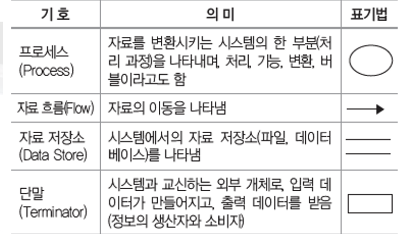
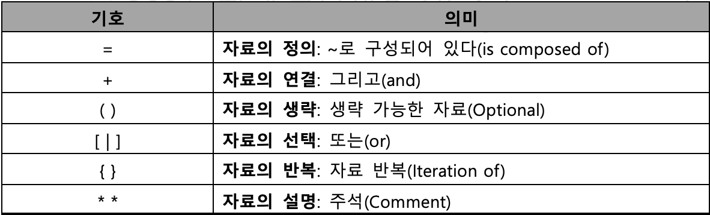
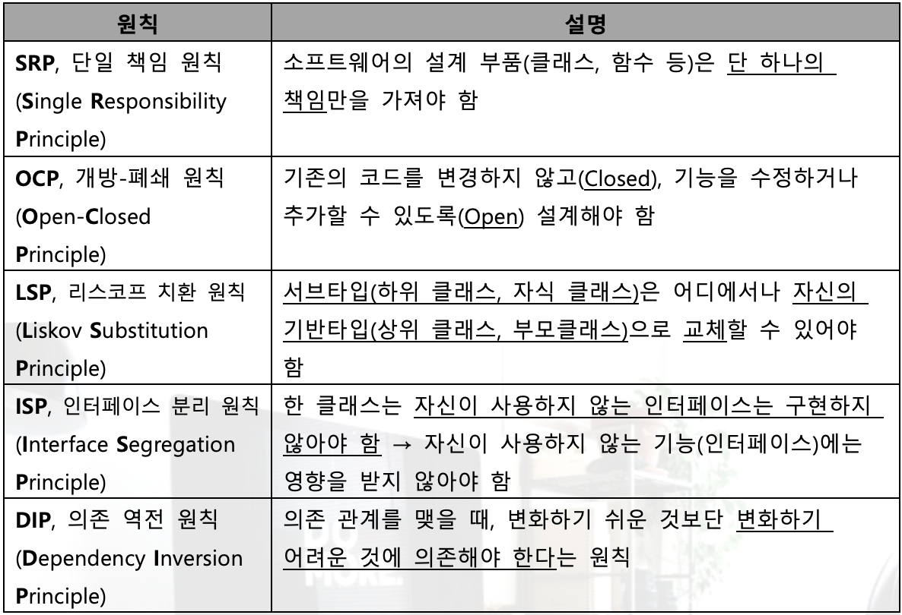
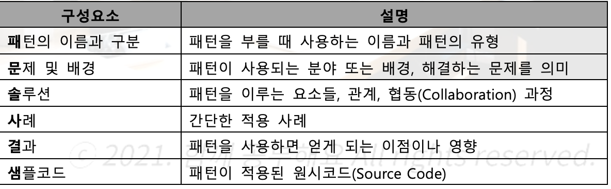
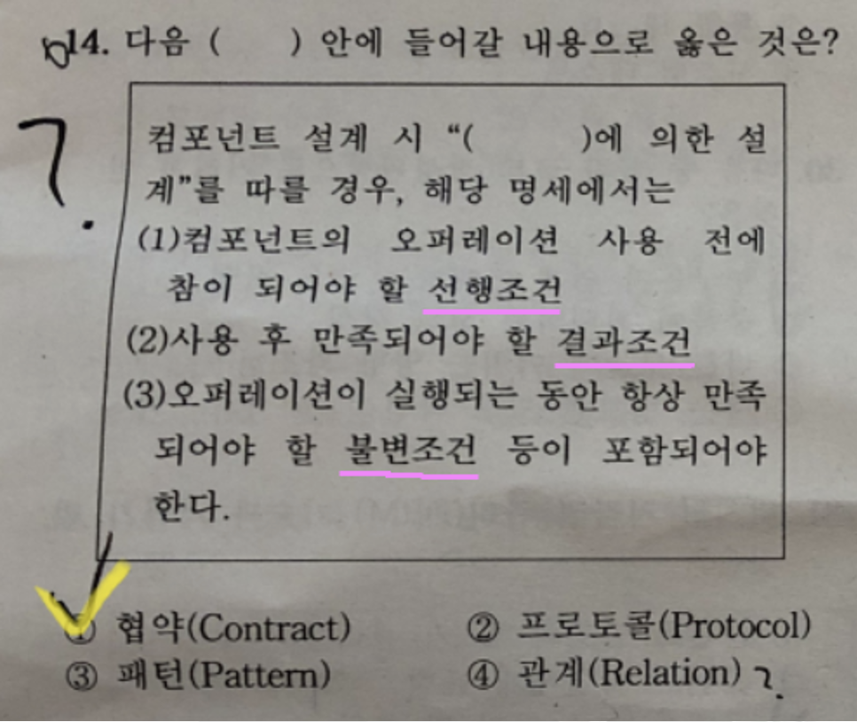

# 소프트웨어 설계

## 소프트웨어 생명주기⭐️⭐️

### 폭포수 모형(Waterfall Model)⭐️

- 가장 오래되고 폭 넓게 사용된 <u>고전적 생명 주기 모형</u>
- 한 단계가 끝나야만 다음 단계로 넘어가는 <u>선형 순차적 모형</u>
- 단계별 정의 및 산출물이 명확
- 개발 중간에 <u>요구사항의 변경에 용이하지 않음</u>
- 타당성 검토 &rarr; 계획 &rarr; 요구**분**석 &rarr; **설**계 &rarr; **구**현(코딩) &rarr; **테**스트(검사) &rarr; **유**지보수

### 프로토 타입 모형(Prototype Model)⭐️

- 시제품을 만들어 최종 결과물을 예측하는 모형
- 인터페이스 중점을 두어 개발
- 개발 중간에 <u>요구사항 변경 용이</u>

### 나선형 모형(Spiral Model, 점진적 모형)⭐️

- 폭포수 모형과 프로토타입 모형의 장점에 <u>위험분석 기능을 추가</u>한 모형
- 점진적 개발 과정 반복으로 요구사항 추가 기능
- 정밀하고 유지보수 과정 필요 X
- **계**획 및 정의 &rarr; **위**험분석 &rarr; 공학적 **개**발 &rarr; **고**객평가

### Agile Model⭐️⭐️

- Agile은 <u>민첩함, 기민함</u> 의미
- <u>변화</u>에 유연하게 대응
- <u>일정한 주기(Iteration, Sprint)</u>를 반복하면서 개발과정 진행
- 절차와 도구 보다 고객(개인)과의 소통에 초점을 맞춤
  ex) **X**P, **S**crum, **Kan**ban, **Cry**stal, **LEAN**

## 기능 중심 개발

### Scrum⭐️

- 팀원 스스로가 scrum team구성
- 개발 작업에 관한 모든것을 스스로 해결해야 함
- Sprint는 <u>2-4주</u> 정도의 기간으로 진행

1. 제품 책임자(**P**roduct **O**wner)

- 요구사항이 담긴 <u>Backlog를 작성하는 주체</u>
- Backlog에 대한 우선순위를 지정, 이해관계자들의 의견을 종합

2. 스크럼 마스터(**S**crum **M**aster)

- 일일 scrum 회의 주관
- 팀원들을 통제하는것이 목표가 아님

3. 개발팀(**D**evelopment **T**eam)

- 제품 책임자와 스크럼 마스터를 제외한 모든 팀원
- 최대 인원 7-8명

4. Scrum 개발 프로세스

- Sprint **계**획 회의 &rarr; **S**print &rarr; **일**일 Scrum &rarr; Scrum **검**토 회의 &rarr; Sprint **회**고

### XP⭐️⭐️

#### 핵심가치

- **용**기(Courage), **단**순성(Simplicity), **의**사소통(Communication), **피**드백
  (Feedback), **존**중(Respect)

#### 기본원리

- Whole Team(**전**체팀), Small Releases(**소**규모 릴리즈), Test-Driven Development(**테**스트 주도 개발), Continuous Integration(**지**속적인 통합),Collective Ownership(**공**동 소유권), Pair Programming(**짝** 프로그래밍), Design Improvement(**디**자인 개선) 또는 Refactoring

## 개발 기술 환경 파악⭐️

### 운영체제

- 하드웨어가 아닌 <u>소프트웨어</u> &rarr; Window, UNIX Linux, Mac OS, iOS, Android
- **가**용성, **성**능, **기**술지원, **구**축비용, **주**변기기(고려사항)⭐️(기출)

### 미들웨어(Middleware)

- 운영체제와 응용 프로그램 사이에서 추가적인 서비스를 제공하는 <u>Software</u>

### 데이터 베이스 관리 시스템(DBMS)

- 사용자와 DB 사이에서 정보를 생성하고 DB를 관리하는 <u>Software</u>
- 데이터베이스(DB)의 구성, 접근 방법, 유지관리에 대한 모든 책임을 짐
- <u>JDBC</u>(Java Database Connectivty), <u>ODBC</u>(Open Database Connectivity, 응용프로그램)
- Oracle, MySQL, SQLite, MongoDB, Redise 등등
- **가**용성, **성**능, **기**술지원, **구**축 비용, 상호 **호**환성(고려사항)

### 웹 어플리케이션 서버(WAS; Web Application Server)

- 정적인 컨텐츠를 처리하는 웹 서버와 반대됨
- 동적인 컨텐츠를 처리하기 위해 사용되는 Middleware(=Software)
- 데이터 접근, 세션 관리, transaction 관리 등을 위한 라이브러리 제공
- Tomcat, JEUS, WebLogic, JBoss, Jetty, Resin 등등
- **가**용성, **성**능, **기**술 지원, **구**축 비용(고려사항)

### 오픈 소스(Open Source)

- 누구나 별다른 제한 없이 사용할 수 있도록 소스코드를 무료로 사용할 수 있게 공개한 것
- **라**이센스의 종류, **사**용자의 수, 기술의 **지**속 가능성(고려사항)

## 요구 사항 정의⭐️

### 기능 요구사항

- 기능, 입력, 출력, 저장, 수행 등등

### 비기능

- 성능, 품질, 제약사항, 호환성, 보안 등등

### 요구사항 개발 프로세스⭐️

- **도**출(elicitation),추출 &rarr; **분**석(Analysis) &rarr; **명**세(Specification) &rarr; **확**인(Validation), **검**증(Valification)

### 요구사항 분석 기법⭐️

- 요구사항 **분**류, **개**념 모델링(UML), 요구사항 **할**당, 요구사항 **협**상, **정**형 분석

### 요구사항 확인 기법⭐️(기출)

- 요구사항 **검**토, **프**로토타이핑, **모**델 검증, **인**수 테스트(알파 테스트, 베타 테스트)

## UML⭐️⭐️⭐️

### UML(Unified Modeling Language)의 구성 요소 ⭐️

- **사**물, **관**계, **다**이어그램

### 사물(Things)

- **구**조, **행**동, **그**룹, **주**해{사물}

### 관계(Relationship)⭐️⭐️(기출)

- **연**관(ㅡ), **집**합(◇), **포**함(◆), **일**반화(ㅡ▷), **의**존(**>), **실**체화(**▷) {관계}

### 구조적, 정적 다이어그램(Diagram)⭐️⭐️(기출)

- **클**래스(Class), **객**체(Obejct), **컴**포넌트(Component), **배**치(Deployment), **복**합체 구조(Composite Structure), **패**키지(Package) {다이어그램(Diagram)}
- 컴포넌트, 배치 다이어그램은 <u>구현 단계</u>에서 사용되는 다이어그램

### 행위 동적 다이어그램(Diagram)⭐️⭐️(기출)

- **U**se Case(사용 사례), **S**equence(순차), **C**ommunication(협업), **상**태(State), **활**동(Activity), 상**호**작용 개요(Interaction Overview), **T**iming {다이어 그램(Diagram)}

## 사용자 인터페이스(UI; User Interface)⭐️

### UI의 구분⭐️

- CLI(Command Line Interface): <u>text</u>로 이뤄진 interface
- GUI(Graphical User Interface): 마우스로 선택해 작업을 하는 <u>그래픽 환경</u>의 Interface
- NUI(Natural User Interface): <u>사람의 말이나 행동</u>으로 기기를 조작하는 Interface
- VUI(Voice User Interface): <u>사람의 음성</u>으로 기기를 조작하는 Interface
- OUI(Oragnic User Interface): <u>모든 사물과 사용자간의 상호작용</u>을 위한 Interface

### UI의 기본 원칙⭐️⭐️(기출)

1. 직관성
2. 유효성: <u>사용자의 목적을 정확하고 완벽</u>하게 달성
3. 학습성: <u>누구나 쉽게 배우고</u> 익힐수 있어야 함
4. 유연성: <u>사용자의 요구 사항을 최대한 수용</u>하고 실수를 최소화 해야 함

### 웹의 3요소

- 웹 **표**준(Web Standards), 웹 **접**근성(Web Accessibilty), 웹 **호**환성(Cross Browsing)

### UI 설계 도구⭐️

- **W**ireframe: 레이아웃을 공유하기 위해 사용
- **S**tory board: 최종적으로 참고하는 <u>작업 지침서, 작업 산출물</u>
- **P**rototype: Interaction을 적용해 실제 구현된 것 처럼 테스트가 가능한 동적인 모형
- **M**ockup: 실제 화면과 유사한 정적인 모형
- **U**se Case: 사용자 측면 요구사항을 다이어그램 형식으로 묘사(Use Case 명세서)

### UI Prototype

#### 장점

1. 사용자를 설득하고 이해시키기 쉬움
2. 개발 시간을 줄일 수 있음
3. 사전 오류 발견 가능

#### 단점

1. 반복적인 개선 및 보완 작업으로 인한 작업 시간 증가 및 자원 소모
2. 부분적으로 Prototyping으로 인한 중요한 작업 생략 가능성 존재
   ex) 페이퍼 프로토타입, 디지털 프로토타입, HTML/CSS

### UI 시나리오 문서 요건

- 이해성(Understandable): 누구나 쉽게 이해할 수 있도록 설명
- 완전성(Completion): 최대한 상세하게 기술
- 일관성(Consistent)
- 가독성(Readable): 표준화된 template등을 활용하여 문서를 쉽게 읽을 수 있도록 해야함
- 수정 용이성(Modifiable): 수정 및 개선이 쉬워야 함
- 추적 용이성(Traceable): 변경사항에 대해서 쉽게 추적할 수 있어야 함

### 기타

- HCI(Human Computer Interaction or Interface): 사람과 컴퓨터의 상호작용을 연구해서 사람이 컴퓨터를 편리하게 사용하도록 만드는 학문
- UX(User Experience): 사용자가 시스템이나 서비스를 이용하면서 느끼고 생각하는 총체적인 경험 &rarr; subjectivity(주관성), contextuality(문맥성), Holistic(총체성)
- 감성공학: 1류; <u>인간의 감성</u> / 2류; <u>심리적 기능</u> / 3류; <u>공학적 및 수학적 모델</u>, <u>객관적</u>

## 품질 요구사항⭐️

### 국제 제품 품질 표준⭐️

- ISO/IEC **9126**
- ISO/IEC **12119**
- ISO/IEC **14598**
- ISO/IEC **25000**: SW 품질 평가 통합 모델, <u>SQuaRE</u>로도 불리며 위 3개 표준을 통합, 품질 **관**리(2500m), 품질 **모**델(2501n), 품질 **측**정(2502n), 품질 **요**구(2503n), 품질 **평**가(2504n)

### ISO/IEC 9126⭐️⭐️(기출)

- **기**능성(Fuctionality): 요구사항을 정확하게 만족하는 <u>기능</u>을 제공하는가?
- **신**뢰성(Reliabilty): 요구된 기능을 정확하고 일관되게 오류없이 수행하는가?
- **사**용성(Usabilty): <u>사용자가 정확하게 이해하고 사용</u>하는가?
- **효**율성(Efficiency): 할당된 시간 동안 한정된 <u>자원</u>으로 얼마나 빨리 처리하는가? &rarr; 시간 효율성, 자원 효율성
- **유지 보수성(Maintainability): 환경의 변화에 소프트웨어를 <u>쉽게 개선, 확장, 수정</u>할 수 있는가?** &rarr; 분석성, 변경성, 안정성, 시험성
- **이**식성(Portability): 소프트웨어를 다른 환경에서도 <u>쉽게 적용</u>할 수 있는가? &rarr; 적용성, 설치성, 대체성, 공존성

### ISO/IEC 14598

- **반**복성(Repeatabiltiy), **재**현성(Reproducibility), **공**정성(Impartiality), **객**관성(Objectivity)

### 국제 프로세스 품질 표준

- ISO/IEC 9001
- ISO/IEC 12207: **기**본 프로세스, **조**직 프로세스, **지**원 프로세스
- ISO/IEC 15504(SPICE): **불**완전 &rarr; **수**행 &rarr; **관**리 &rarr; **확**립 &rarr; **예**측 &rarr; **최**적화
- CMMI(Capability Maturity Model Integration): 조직 차원의 성숙도를 평가하는 단계별 표현과 프로세스 영역별 능력도를 평가하는 연속적 표현이있음

## 소프트웨어 아키텍쳐⭐️

- 사용자의 비 기능적 요구사항으로 나타난 제약 반영
- 기능적 요구사항을 구현하는 방법을 찾는 해결 과정

### 모듈화(Modularity)

- 시스템 기능들을 모듈 단위로 나눠 소프트웨어의 성능 및 재사용성을 향상 시키는 것
- 모듈의 크기 多: 모듈 개수 적음, 모듈 간 통합 비용 적음, <u>모듈 하나의 개발 비용 큼</u>
- 모듈의 크기 小: 모듈 개수 많음, <u>모듈 간 통합 비용 큼</u>

### 추상화(Abstraction)

- <u>전체적이고 포괄적인 개념</u>을 설계한 후 <u>차례로 세분화</u>하여 구체화 시키는 것
- **과**정 추상화: 자세한 수행 과정을 정의하지 않고, 전반적인 흐름만 파악
- **데**이터 추상화: 데이터의 세부적인 속성이나 용도를 정의하지 않고, 데이터 구조를 대표하는 표현으로 대체
- **제**어 추상화: <u>이벤트 발생</u>의 정확한 절차나 방법을 정의하지 않고 대표하는 표현으로 대체

### 단계적 분해(Stepwise Refinement)

- Niklaus Wirth에 의해 제안된 하향식 설계 전략
- 추상화의 반복에 의해 세분화
- 소프트웨어 기능에서부터 시작해 절차적으로 구체화
- 상세한 내역은 가능한 한 뒤로 미루어 진행

### 정보 은닉

- 한 모듈 내부에 포함된 절차와 자료들의 정보가 감추어져 다른 모듈이 접근하거나 변경하지 못하도록 하는 기법
- 정보 은닉을 통한 독립적 모듈 수행 가능
- 모듈 변경 시 영향을 받지 않아 수정, 시험, 유지보수 용이

## 아키텍처 패턴⭐️

### 레이어 패턴(Layers Pattern)

- 시스템을 계층(Layer)로 구분하여 구성하는 고전적 방법 # OSI 참조 모델

### 클라이언트-서버 패턴(Client-Server Pattern)

- 하나의 서버 컴포넌트와 다수 클라이언트 컴포넌트로 구성되는 패턴
- 클라이언트나 서버는 요청과 응답을 받기 위해 동기화 되는 경우를 제외하고는 서로 독립적
  컴포넌트(Component): 독립적인 업무 또는 기능을 수행하는 실행코드 기반으로 작성된 모듈

### 파이프-필터 패턴(Pipe-Filter Pattern) ⭐️

- 데이터 스트림 절차의 각 단계를 필터 컴포넌트로 캡슐화해 파이프를 통해 데이터를 전송하는 패턴
- 필터 컴포넌트는 재사용성이 좋고, 추가가 쉬워 확장 용이
- 필터 컴포넌트들을 재배치하여 다양한 파이프 라인 구축 가능
  UNIX의 쉘(Shell)

### 모델-뷰 컨트롤러 패턴(Model-View-Controller Pattern) ⭐️⭐️

- 서브 시스템을 3개의 부분으로 구조화하는 패턴
- 모델(Model): 서브 서스템의 핵심 기능과 <u>데이터를 보관</u>
- 뷰(View): 사용자에게 <u>정보를 표시</u>
- 컨트롤러(Controller): 사용자로부터 받은 <u>입력 처리</u> / 뷰 제어/ UI 담당
- 각 부분은 별도의 컴포넌트로 분리되어 있으므로 서로 영향을 받지않고 개발 작업 수행
- 한개의 모델에 대해 여러개의 뷰를 만들 수 있으므로 <u>대화형 어플리케이션</u>에 적함

### 마스터-슬레이브 패턴(Master-Slave Pattern)

- 마스터 컴포넌트에서 슬레이브 컴포넌트로 분할한 후, 슬레이브 컴포넌트에서 처리된 결과물을 다시 돌려받는 방식으로 작업을 수행하는 패턴 #장애 허용 시스템(Fault Tolerance System), 병렬 컴퓨팅 시스템⭐️

### 브로커 패턴(Broker Pattern)

- 컴포넌트와 사용자를 연결해주는 패턴 #분산 환경 시스템

### 피어-투-피어 패턴(Peer-to-Peer Pattern)

- 피어를 하나의 컴포넌트로 간주하고, 각 피어는 서비스를 호출하는 <u>클라이언트가 될수도, 서비스를 제공하는 서버가 될 수도</u> 있는 패턴 #Multi Threading 방식 사용

### 이벤트-버스 패턴(Event-Bus Pattern)

- 소스가 특정 채널에 이벤트 메세지를 발행하면, 해당 채널을 구독한 리스너들에게 메시지를 받아 이벤트를 처리하는 방식
- 이벤트를 생성하는 **소**스(Source), 이벤트를 수행하는 **리**스너(Listener), 이벤트의 통로인 **채**널(Channel), 채널들을 관리하는 **버**스(Bus)

### 블랙보드 패턴(Blackboard Pattern)

- <u>해결책이 명확하지 않은 문제를 처리</u>하는데 유용한 패턴 #음성인식, 차량식별, 신호해석 ⭐️

### 인터프리터 패턴(Interpreter Pattern)

- 특정 언어로 작성된 프로그램 코드를 해석 하는 컴포넌트를 설계할 때 사용됨

## 객체 지향(Object Oriented)⭐️⭐️

### 객체(Obejct)

- <u>독립적으로 식별 가능한 이름</u>을 가짐
- 객체가 가질 수 있는 조건인 상태(State)는 일반적으로 시간에 따라 변함
- 객체와 객체는 상호 연관성에 의한 관계가 형성됨
- 객체가 반응할 수 있는 메세지의 집합을 행위(연산, Method)라고 하며, 객체는 행위의 특징을 나타냄
- 객체는 <u>일정한 기억장소를 갖고 있음</u>

### 클래스(Class)⭐️⭐️

- <u>하나 이상의 유사한 객체들을 묶어서 하나의 공통된 특성을 표현한 것</u>⭐️
- 공통된 속성과 연산(행위)를 갖는 객체의 집합
- 객체지향프로그램에서 <u>데이터를 추상화하는 단위</u>⭐️
- 각각의 <u>객체들이 갖는 속성과 연산(Method)을 정의</u>하고 있는 틀
- 슈퍼 클래스(Super Class)는 특정 클래스의 상위(부모) 클래스
- 서브 클래스(Sub Class)는 특정 클래스의 하위(자식) 클래스

### 인스턴스(Instance)

- 클래스에 속한 각각의 객체
- 클래스로 부터 새로운 객체를 생성하는 것을 인스턴스화(Instantiation)라고 함

### 메서드(Method)

- 클래스로부터 생성된 객체를 사용하는 방법
- 전통적 시스템의 함수(Function)또는 프로시져(Procedure)에 해당하는 연산

### 메세지(Message)

- 객체에게 어떤 행위를 하도록 <u>지시하기 위한 방법</u>

### <u>캡</u>슐화(Encapsulation) ⭐️ (기출)

- 데이터(속성)와 데이터를 처리하는 함수를 하나로 묶는 것
- 인터페이스를 제외한 세부 내용이 <u>은폐(정보 은닉)</u>되어 외부 접근이 제한됨
- <u>정보 은닉 측면과 가장 밀접한 관계</u>가 있음
- 외부 모듈의 변경으로 인한 파급 효과가 적음
- 재사용 용이, 인터페이스 단순해짐
- 결합도 down, 응집도 up

### <u>상</u>속(Inheritance) ⭐️

- 이미 정의된 상위(부모)클래스의 모든 속성과 연산을 하위(자식) 클래스가 물려받는 것
- 소프트웨어의 재사용(Reuse)을 높이는 중요한 개념

### <u>다</u>중 상속(Multiple Inheritance) ⭐️

- 한 개의 클래스가 두 개 이상의 상위(부모)클래스로부터 속성과 연산을 상속 받는 것

### 다<u>형</u>성(Polymorphism) ⭐️

- 하나의 메세지에 대해 각각의 객체(Class)가 가지고 있는 고유한 방법(특성)으로 응답 할 수 있는 능력
  ex) '+'연산자의 경우 숫자 클래스에서는 덧셈, 문자 클래스에서는 문자열 연결 기능

## 결합도(Coupling) ⭐️⭐️ (기출)

- 모듈 간에 상호 의존하는 정도 또는 두 모듈 사이의 연관 관계를 의미
- 결합도는 낮을수록 좋다 = 독립적인 모듈

1. **내**용 결합도(Content Coupling): 한 모듈이 다른 모듈의 내부 기능 및 그 내부 자료를 <u>직접 참조</u> 하거나 수정할 때의 결합도
2. **공**통 결합도(Common Coupling): <u>공유되는 공통 데이터 영역</u>을 여러 모듈이 사용할 때의 결합도(전역 변수)
3. **외**부 결합도(External Coupling): 어떤 모듈에서 선언한 데이터(변수)를 외부의 다른 모듈에서 참조할 때의 결합도(순차적)
4. **제**어 결합도(Control Coupling): 어떤 모듈이 다른 모듈 내부의 논리적인 흐름을 제어하기 위해 제어 신호를 이용하여 통신하거나 제어 요소를 전달하는 결합도
5. **스**탬프 결합도(Stamp Coupling): 모듈 간의 인터페이스로 배열이나 레코드 등의 자료 구조가 전달될 때의 결합도
6. **자**료 결합도(Data Coupling): 어떤 모듈이 다른 모듈을 호출하면서 매개 변수(파라미터)나 인수로 데이터를 넘겨주고, 호출 받은 모듈은 받은 데이터에 대한 처리 결과를 다시 돌려주는 결합도

## 응집도(Cohesion) ⭐️⭐️ (기출)

- 모듈의 내부 요소들의 서로 관련되어 있는 정도
- 응집도는 높을수록 좋다 = 독립적인 모듈

1. **우**연적 응집도(Coincidental Cohesion): 모듈 내부의 각 구성 요소들이 <u>서로 관련 없는 요소</u>로만 구성된 경우의 응집도
2. **논**리적 응집도(Logical Cohesion): 유사한 성격을 갖거나 특정 형태로 분류되는 처리 요소들로 하나의 모듈이 형성되는 경우의 응집도
3. **시**간적 응집도(Temperal Cohesion): 특정 시간에 처리되는 몇개의 기능을 모아 하나의 모듈로 작성할 경우의 응집도
4. **절**차적 응집도(Procedural Cohesion): 모듈이 다수의 관련 기능을 가질 때 모듈 안의 구성 요소들이 그 기능을 순차적으로 수행할 경우의 응집도
5. **통**신적(교환적) 응집도(Communication Cohesion): 동일한 입력과 출력을 사용하여 서로 다른 기능을 수행하는 구성 요소들이 모였을 경우의 응집도
6. **순**차적 응집도(Sequential Cohesion): 모듈 내 하나의 활동으로부터 나온 <u>출력데이터(출력값)</u>를 그 다음 활동의 입력 데이터로 사용할 경우의 응집도
7. **기**능적 응집도(Functional Cohesion): 모듈 내부의 모든 기능요소들이 단일 문제와 연관되어 수행될 경우의 응집도

## 공통 모듈 ⭐️ (기출)

1. **정**확성(Correctness): 시스템 구현 시 해당 기능이 필요하다는 것을 알 수 있도록 <u>정확히</u> 작성
2. **명**확성(Clarity): 해당 기능에 대해 <u>일관되게 이해되고, 한 가지로 해석 될 수 있도록</u>, 중의적으로 해석되지 않도록 명확하게 작성
3. **완**전성(Completeness): 시스템 구현을 위해 <u>필요한 모든 것을 기술</u>
4. **일**관성(Consistency): 공통 기능들 간 <u>상호 충돌이 발생하지 않도록</u> 작성
5. **추**적성(Traceability): 기능에 대한 요구사항의 출처, 관련 시스템 등의 <u>관계를 파악할 수 있도록</u> 작성
6. 재사용(Reuse)규모에 따른 분류 (기출): 함수와 **객체**, **컴포넌트**, **애플리케이션**

## 코드 ⭐️⭐️ (기출)

- **식**별, **분**류, **배**열, **간**소화, **표**준화, **연**상, **암**호화, **오**류 검출

1. 순차, 순서 코드(Sequence Code, 일련 번호 코드): 일정 기준에 따라 최초의 자료부터 <u>차례로 일련번호를 부여</u>하는 방법 ⭐️
   ex) 1, 2, 3, 4, ...
2. 블록 코드(Block Code, 구분 코드): 공통성이 있는 것 끼리 블록으로 구분하고, 각 블록 내에서 일련 번호 부여하는 방법 ⭐️
   ex) 1001-1100: 총무부, 1101-1200:영업부
3. 10진 코드(Decimal Code, 도서 분류식 코드): 0-9까지 10진 분할 하고, 다시 각각에 대해 10진 분할하는 방법을 필요한 만큼 반복 ⭐️
   ex) 1000: 공학, 1100: 소프트웨어 공학, 1110: 소프트웨어 설계
4. 그룹 분류 코드(Group Classification Code): 일정 기준에 따라 <u>대분류, 중분류, 소분류 등으로 구분</u>하고, 각 <u>그룹 안에서</u> 일련번호를 부여하는 방법
   ex) 1-01-001: 본사-총무부-인사계, 2-01-001: 지사-총무부-인사계
5. 연상 코드(Mnemonic Code, 기호 코드):명칭이나 약호와 관계있는 숫자나 문자, 기호를 이용하여 코드를 부여하는 방법
   ex) TV-40: 40인치 TV, L-15-220: 15W 220V 램프
6. 표의 숫자 (Significant Digit Code, 유효 숫자 코드): 길이, 넓이, 부피, 지름, 높이 등의 <u>물리적 수치를 그대로 코드에 적용</u>시키는 방법 ⭐️
7. 합성 코드(Combined Code): 2개 이상의 코드를 조합하여 만드는 방법
   ex) 연상 코드+순차 코드 → KE-711: 대한항공 711기, AC-253: 에어캐나다 253기
8. 코드 부여 체계

- <u>이름만으로 개체의 용도와 적용 범위를 알 수 있도록</u> 코드를 부여하는 방식
- 각 개체에 <u>유일한 코드 부여</u>하여 개체들의 식별 및 추출을 용이하게 함
- <u>코드를 부여하기 전</u> 각 단위 시스템의 고유한 코드와 개체를 나타내는 코드가 정의되야 함
  ex) PJC-COM-003: 전체 시스템 단위의 3번째 공통 모듈
  ex) PY3-MOD-010: PY3라는 단위 시스템의 10번째 모듈

## 디자인 패턴 ⭐️⭐️ (기출)

- 아키텍처 패턴이 디자인 패턴보다 상위 수주느의 설계에 사용됨
- 서브 시스템에 속하는 <u>컴포넌트들과 그 관계</u>를 설계하기 위한 참조 모델
  cf) 아키텍처 패턴은 <u>전체 시스템 구조</u>를 설계하기 위한 참조 모델

### 생성 패턴(Creational Pattern) ⭐️ (기출)

- **추**상 팩토리(Abstract Factory): 서로 연관, 의존하는 객체들을 그룹으로 생성해 추상적을 표현
- **빌**더(Builder) 객체의 생성 과정과 표현 방법 분리 &rarr; 동일한 객체 생성에도 <u>서로 다른 결과</u>
- **팩**토리 메소드(Factory Method): 객체를 생성하기 위한 인터페이스를 정의하여, 어떤 클래스가 인스턴스화 될 것 인지는 <u>서브클래스가 결정</u>하도록 하는 것(<u>Virtual-Constructor 패턴</u>)
- **프**로토타입(Prototype): 원본 객체를 복제하는 방법
- **싱**글톤(Singleton): 하나의 객체를 여러 프로세스가 동시에 참조할 수 없음

### 구조 패턴(Structural Pattern) ⭐️

- **A**dapter: <u>호환성이 없는 클래스</u> 인터페이스를 이용할 수 있도록 변환 해주는 패턴
- **B**ridge: <u>구현부에서 추상층을 분리</u>하여, 독립적으로 확장 및 다양성을 가지는 패턴
- **C**omposite: 여러 객체를 가진 <u>복합, 단일 객체</u>를 구분 없이 다룰 때 사용하는 패턴
- **D**ecorator: 상속을 사용하지 않고도 객체의 기능을 <u>동적으로 확장</u>해주는 패턴
- **F**acade: 서브 클래스들의 <u>기능을 간편하게 사용</u>사용할 수있도록 하는 패턴
- **F**lyWeight: 공유해서 사용함으로써 메모리를 절약 하는 패턴
- **P**roxy: <u>접근이 어려운 객체를 연결</u>해주는 인터페이스 역할을 수행하는 패턴

## 행위 패턴(Behavioral Pattern)

- 책임 연쇄(Chain of Responsibiltiy): 한 객체가 처리하지 못하면 <u>다음 객체로 넘어가는</u> 패턴
- Command: 요청에 사용되는 각종 명령어들을 추상, 구체 클래스로 분리하여 단순화함
- Interpreter: <u>언어에 문법 표현을 정의</u>하는 패턴
- Iterator(반복자): <u>동일한 인터페이스를 사용</u>하도록 하는 패턴
- Mediator(중재자): <u>서로의 존재를 모르는 상태</u>에서도 <u>협력</u>할 수 있게 하는 패턴
- Memento: 요청에 따라 객체를 해당 시점의 상태로 <u>돌릴 수 있는 기능</u>을 제공하는 패턴
- Observer: <u>관찰 대상</u>의 변화를 탐지하는 패턴
- State(상태): 객체의 상태에 따라 동일한 동작을 다르게 처리해야 할 때 사용하는 패턴
- Strategy: Client에 <u>영향을 받지 않는 독립적인 알고리즘을 선택</u>하는 패턴
- Template Method: 유사한 서브 클래스를 묶어 <u>공통된 내용을 상위클래스에 정의</u>하는 패턴
- Visitor: <u>필요할때 마다 해당 클래스에 방문해서 처리</u>하는 패턴
  `생성 패턴과 구조 패턴에 해당 안되면 행위패턴`

## 인터페이스 요구사항 검증 ⭐️

### 요구사항 검증(Requirements Verification)

- 인터페이스 요구사항 검토 계획 수립 &rarr; 검토 및 오류 수정 &rarr; 베이스라인 설정

### 요구 사항 검증 방법 ⭐️⭐️ (기출)

- **동**료 검토(Peer Review): 요구사항 명세서 <u>작성자가 내용을 직접 설명</u>하고 동료들이 이를 들으면서 결함을 발견하는 검토 방법
- **W**alk Through: <u>검토 회의 전에 요구사항 명세서를 미리 배포</u>하여 사전 검토한 후, 짧은 검토회의를 통해 결함을 발견하는 방법
- **I**nspection: 요구사항 명세서 작성자를 제외한 다른 검토 <u>전문가들이 확인</u>하면서 결함을 발견하는 검토 방법

### 인터페이스 요구사항 검증 주요 항목

- **기**능성(Functionality), **완**전성(Completeness), **일**관성(Consistency), **명**확성(Unambiguity), **검**증 가능성(Verifiability), **추**적 가능성(Traceabiltiy), **변**경 용이성(Easily Changeabile)

## 인터페이스 ⭐️

### 인터페이스 식별

- <u>인터페이스 요구사항 명세서</u>와 <u>인터페이스 요구사항 목록</u>을 기반으로 개발할 시스템과 이와 연계할 내, 외부 시스템 사이의 <u>인터페이스를 식별하고 인터페이스 목록을 작성</u>하는 것

### 인터페이스 시스템 식별

- 인터페이스별로 인터페이스에 참여하는 시스템들을 송신 시스템과 수신 시스템으로 구분하여 작성하는 것

### 인터페이스 표준 항목 ⭐️

- 시스템 공통부: 시스템 간 연동시 필요한 공통 정보
  `인터페이스 ID, 전송시스템 정보, 서비스 코드 정보, 응답 결과 정보, 장애 정보`
- 거래 공통부: 시스템들이 연동된 후 송,수신 되는 <u>데이터를 처리할 때 필요한 정보</u>
  `직원 정보, 승인자 정보, 기기정보, 매체 정보`

## 인터페이스 방법 명세화 ⭐️⭐️

### 시스템 연계 기술 ⭐️⭐️⭐️

#### 직접 연계 방식

- DB **L**ink: <u>수신 시스템에서 DB Link를 생성</u>하고 송신 시스템에서 해당 DB link를 직접 참조하는 방식
  ex) 테이블 명 @DB Link명
- DB **C**onnection: <U>수신 시스템의 WAS에서</u> 송신 시스템 DB로 연결하는 DB Connection Pool)을 생성하고 연계 프로그램에서 해당 DB Connection Pool 이름 이용
  ex) 송신 시스템의 Data Source = DB Connection Pool 이름
- **A**PI/Open API: 송신 시스템의 DB에서 데이터를 읽어와 제공하는 <u>애플리케이션 프로그래밍 인터페이스 프로그램</u>
- **J**DBC: 수신 시스템의 프로그램에서 JDBC 드라이버를 이용하여 송신 시스템 DB와 연결
- **H**yper Link: 웹 어플리케이션에서 이용
- 연계 솔루션: EAI 서버와 송,수신 시스템에 설치되는 클라이언트를 이용하는 방식

#### 간접 연계 방식

- **S**ocket: <u>서버는 통신을 위한 socket을 생성하여 포트를 할당</u>하고 <u>Client의 통신 요청</u>시 Client와 연결하는 네트워크 기술
- **W**eb Service: 웹 서비스에서 <u>WSDL, UDDI, SOAP 프로토콜</u>을 이용해 연계하는 서비스
  - WSDL(Web Services Description Language): 웹 서비스와 관련된 서식이나 프로토콜 등을 표준적인 방법으로 기술하고 게시하기 위한 언어
  - UDDI(Universal Description, Discovery and Integration): 인터넷에서 전 세계의 비즈니스 업체 목록에 자신의 목록을 등록하기 위한 <U>확장성 생성 언어(XML)</u>기반 규격
  - SOAP(Simple Object Access Protocol): 웹 서비스를 실제로 이용하기 위한 <U>객체 간의 통신 규약</u>
- ES**B**(Enterprise Service Bus):개방형 표준인 웹 서비스를 이용하며 메시징과 웹 서비스, 데이터 변형, 인텔리전트 라우팅을 결합하여 다양한 애플리케이션 간의 연결과 상호 작용을 지원하는 표준 기반의 미들 웨어 플랫폼

### 인터페이스 통신 유형

- 단방향: 시스템에서 거래 요청만 하고 응답은 없는 방식
- 동기(Sync): 시스템에서 거래 요청 후 응답이 올 때까지 대기(Request-Reply)하는 방식
  ex) 은행 업무: 송금 버튼을 누르면 즉시 버튼에 대한 응답으로 돈이 송금됨
- 비동기(Async): 시스템에서 거래 요청 후 다른 작업을 수행하다 응답이 오면 처리하는 방식
  ex) 채점하는 교수님: 시험지를 받고 채점하는건 그 날 즉시하거나 다른일 처리 후 다음 날 해도 상관없음
  `동기, 비동기는 양방향`

### 인터페이스 처리 유형

- **실**시간 방식: 사용자가 <U>요청한 내용을 바로 처리</u>해야 할때 사용하는 방식
- **지**연 처리 방식: 매건 단위 처리로 비용이 많이 발생할 때 사용하는 방식
- **배**치 방식: 대량의 데이터 처리할 때 사용하는 방식

### 인터페이스 발생 주기

- 매일, 수시, 주 1회 등

## 미들웨어 솔루션 명세 ⭐️⭐️ (기출)

- 운영체제와 해당 운영체제에서 실행 되는 응용 프로그램 사이에서 운영체제가 제공하는 서비스 이외에 추가적인 서비스를 제공하는 소프트웨어

### Database

- Client에서 원격의 DB에 연결하기 위한 미들웨어, 2-Tier 아키텍처
  - ODBC(Microsoft), IDAPI(볼랜드), Glue(Oracle)

### RPC(Remote Procedure Call, 원격 프로시저 호출)

- 응용 프로그램에서 프로시저를 사용해 <u>원격 프로시저를 로컬 프로시저 처럼 호출</U>하는 방식의 미들웨어
  - Entera(이큐브시스템스), ONC/RPC(OSF)

### MOM(Message Oriented Middleware, 메세지 지향 미들웨어) ⭐️

- <u>메세지 기반의 비동기형 메시지를 전달</u>하는 방식의 미들웨어
  - MQ(IBM), Message Q(Oracle), JMS(JCP)

### TP-Monitor(Transaction Processing Monitor, 트랜잭션 처리 모니터) ⭐️

- <u>항공기나 철도 예약 업무</u> 등과 같은 온라인 트랜잭션 업무에서 트랜잭션 처리 및 감시하는 미들웨어
- 사용자 수가 증가해도 <u>빠른 응답 속도를 유지해야 하는 업무</u>에 주로 사용됨
  - tuxedo(Oracle), tmax(티맥스 소프트)

### Legacyware

- 기존 어플리케이션에 <u>새로운 업데이트된 기능을 덧붙이고</u> 할 때 사용되는 미들웨어

### ORB(Object Request Broker, 객체 요청 브로커) ⭐️

- 객체 지향 미들웨어로 코바(CORBA) 표준 스펙을 구현한 미들웨어
  - CORBA(Common Object Request Broker Architecture): 네트워크에서 분산 프로그램 객체를 생성, 배포, 관리하기 휘한 규격을 의미
    - Orbix(Micro Focus), CORBA(OMG)

### WAS(Web Application Server) ⭐️

- 사용자의 요구에 다라 변하는 <u>동적인 컨텐츠를 처리</u>하기 위해 사용되는 미들웨어
  cf) 웹 서버: 정적인 컨텐츠를 처리
- Client-Server 환경 보다는 <u>웹 환경을 구현하기 위한</U> 미들웨어
- HTTP 세션 처리를 위한 웹 서버 기능 뿐만 아니라 미션-크리티컬한 기업 업무 까지 JAVA, EJB 컴포넌트기반으로 구현이 가능
  - Web Logic(Oracle), WebSphere(IBM), JEUS, Tomcat

## 추가 정리 및 기출 문제 ⭐️⭐️⭐️

### 플랫폼의 유형

- **싱**글 사이드 플랫폼: 제휴 관계를 통해 <U>소비자와 공급자를 연결하는 형태</u>
  ex) 아이튠즈, 안드로이드 마켓
- **투** 사이드 플랫폼: 두 그룹을 중개하고 <u>모두에게 개방하는 형태</u>
  ex) 소개팅 앱
- **멀**티 사이드 플랫폼: 다양한 이해관계 <u>그룹을 연결하여 중개하는 형태</u>
  ex) 페이스북, 인스타그램

### 플랫폼 성능 특성 분석 기법

- 사용자의 **인**터뷰, **성**능 테스트, **산**출물 점검

### OSI 7계층(Layer) ⭐️⭐️

- 응용 계층(**A**pplication Layer, 7): <u>사용자와 네트워크 간</u> 응용서비스 연결, 데이터 생성
  - HTTP, FTP, TELNET, SMTP/SNTP, DNS
- 표현 계층(**P**resentation Layer, 6): 데이터 형식 설정, <u>코드변환, 암/복호화</u>
  - JPEG, MPEG
- 세션 계층(**S**ession Layer, 5): <u>연결 접속(유지)</u>, 동기제어, <u>동기점(대화)</u>
  - SSH, TLS
- 전송 계층(**T**ransport Layer, 4): <u>종단간(End to End) 신뢰성</u> 있고 효율적인 데이터 전송, 데이터 분할, 재조립, 흐름 제어(슬라이딩 윈도우), 오류 제어, 혼잡 제어
  - TCP/UDP, RTCP → <u>세그먼트(Segment)</u>
- 네트워크 계층(**N**etwork Layer, 3): 단말기 간 데이터 전송을 위한 최적화된 <u>경로(라우팅) 제공</u>
  - IP, ICMP, IGMP, RIP, OSPF → <u>패킷(Packet)</u>
- 데이터 링크 계층(**D**ata Link Layer, 2): <u>인접 시스템 간</u> 물리적 연결을 이용해 데이터 전송, 동기화, 오류제어, 흐름 제어, 오류검출 및 재전송
  - HDLC, PPP, LLC, Ethernet(이더넷) → <u>프레임(Frame)</u>
- 물리 계층(**P**hysical Layer, 1): 매체 간의 <u>전기적, 기능적, 절차적</u> 기능 정의
  - RS-232C → 비트(Bit)

### LEAN &rarr; Agile 방법론 유형중 하나

- **낭**비제거, **품**질 내재화, **지**식 창출, 늦은 **확**정, 빠른 **인**도, **사**람 존중, **전**체 최적화

### CASE(Computer-Aided Software Engineering) 도구의 분류 (기출)

- **상**위 CASE: 계획수립, 요구분석, 기본설계 단계를 <u>다이어그램</u>으로 표현
  - 모순 검사, 오류 검증, 자료흐름도 작성 지원
- **중**위 CASE
  - 상세 설계 작업, <u>화면 출력</u> 작성 지원
- **하**위 CASE
  - 시스템 명세서, <u>소스 코드 생성></u> 지원

### UI 컨셉션 세부 수행 활동

- **정**보 구조 설계 → 대표 화면 **와**이어 프레임 스케치 → 페이퍼 프로토타입을 통한 **스**토리보드 설계

### UI 설계 프로세스

- **문**제 정의 → **사**용자 모델 정의 → **작**업 분석 → **컴**퓨터 오브젝트 및 기능 정의 → 사용자 **인**터페이스 정의 → **디**자인 평가

### 소프트웨어 설계 유형

- **자**료 구조 설계, **아**키텍처 설계, **인**터페이스 설계, **프**로시저 설계

### 소프트웨어 아키텍처 4+1뷰

- **유**스케이스 뷰, **논**리 뷰, **프**로세스 뷰, **구**현 뷰, **배**포 뷰

### 럼바우의 객체 지향 분석 / 객체 모델링 기법(OMT) ⭐️⭐️⭐️ (기출)

- 객체 모델링: 객체<u>다이어그램</u>
- 동적 모델링: <u>상태도</u>(상태 다이어그램)
- 기능 모델링: <u>자료 흐름도</u>

### 요구사항 관리 프로세스

- 요구사항 **협**상 → 요구사항 **기**준선 → 요구사항 **변**경관리 → 요구사항 **확**인 및 검증

### 인터페이스 정의서 작성

- **인**터페이스 ID, **최**대 처리 횟수, 데이터 **크**기(평균/최대), **시**스템 정보, **데**이터 정보

### 자료 흐름도(Data Flow Diagram) ⭐️⭐️ (기출)

- PTSD &rarr; **P**rocess, **T**erminator, Data **S**tore, **D**ata Flow

### UML 확장 모델의 스테레오 타입 객체 표현 기호 (기출)

- << >>

### 자료 사전 기호 (기출)

### 객체지향 기법에서 클래스들 사이의 '부분-전체(part-whole)'관계 또는 '부분(is-a-part-of)'의 관계로 설명되는 연관성을 나타내는 용어는? (기출)

① 일반화 ② 추상화 ③ 캡슐화 **④ 집단화**

- 일반화(Generalization)
  - 객체들에 있어 공통적인 성질들을 상위 객체로 정의하고, 특수화(specialization)된 객체들을 하위의 부분형(subtype) 객체로 정의하는 추상화 방법이다.
- 추상화(Abstraction)
  - 현실 세계의 물체를 객체에 사상할 때에는 현실을 그대로 객체로서 표현하는 것이 아니고, 문제의 중요한 측면, 혹은 주목하고 싶은 문제의 측면을 강조한다. 즉, 불필요한 부분을 생략하고 <u>객체의 가장 중요한 것에만 중점을 두어 간략화</u> 시킨 것을 말한다.
- 캡슐화(Encapsulation)

  - 객체의 <u>자료와 행위를 하나로 묶고, 실제 구현 내용을 외부에 감추는 것</u>을 캡슐화라고 한다. 이렇게 캡슐화 된 객체의 행위는 외부에서 볼 때는 실제가 아닌 추상적인 것이 되므로 정보 은닉(information hiding)개념이 지켜진다.

  - 정보 은닉은 객체가 캡슐화를 통하여 내부의 데이터나 오퍼레이션의 구현 내용을 감추는 것을 말한다. 즉, 외부에서의 무분별한 접근을 허용하지 않는다는 것이다.

- 집단화(Aggregation)
  - <u>서로 관련 있는 여러 개의 객체를 묶어 한 개의 상위 객체를 만드는 것</u>이다. 집단화는 여러 개의 속성을 묶어 사용자 정의형의 엔티티를 만드는 수단으로 사용한다. 한 객체에서 하나 이상의 객체는 사용자 표정의 형이 될 때 복합 객체(composite object)라고 불린다. 즉, 집단화는 **복합 객체의 종속 성분을 모델링하기 위해 사용**되며, 이들 복합 성분 클래스 관계를 통해 복합 속성 계층(composite attribute hierarchy)을 형성한다.

### HIPO(Hierarchy Input Process Output) (기출)

- <u>하향식 소프트웨어 개발</u>을 위한 문서화 도구
- HIPO 차트 종류: 가시적 도표, 총체적 도표, 세부적 도표
- 기능과 자료의 의존 관계를 동시에 표현할 수 있음
- 보기 쉽고 이해하기 쉬움

### 객체지향 분석 방법론 (기출)

- Coad와 Yourdon 방법 ⭐️
  - E-R 다이어그램을 사용하여 객체의 행위를 모델링하며, 객체 식별, 구조 식별, 주체 정의, 속성 및 관계 정의, 서비스 정의 등의 과정으로 구성되는 것
- Booch 방법
  - 미시적(Micro) 개발 프로세스와 거시적(Macro) 개발 프로세스를 모두 사용하는 분석 방법
- Jacobson 방법
  - 유스케이스(Use Case, 사용사례)를 강조하여 사용하는 분석 방법
- Wirfs-Brocks 방법
  - 분석과 설계 간의 구분이 없고, 고객 명세서를 평가해서 설계 작업까지 연속적으로 수행하는 분석 방법

### UML의 시퀀스 다이어그램의 구성 항목 (기출)

- **생**명선(Life Line), **실**행(Activation, 활성 박스), **메**시지(Message)

### 객체지향 설계 원칙 (기출)

- **SOLID**

### 디자인 패턴 구성요소 (기출)

- **패문솔 사결샘**

### DBC(Design by Contract, 계약에 의한 설계) (기출)

- 프로그램 모듈들의 책임을 문서화 하는데 초점</u>을 맞춤
- 각각의 모듈이 <u>져야 하는 기능만큼만 동작</u> 하도록 함
- 위의 개념들을 <u>문서화 하고 검증</u>하는 것이 핵심

### CASE (Computer-Aided Software Engineering) 도구 (기출)

- 소프트웨어 개발 과정의 일부 또는 전체를 <u>자동화하기 위한 도구</u>
- 표준화된 개발 환경 구축 및 문서 <u>자동화 기능 제공</u>
- 작업 과정 및 데이터 공유를 통해 <u>작업자 간의 커뮤니케이션 증대</u>
  **주요기능**: S/W 라이프 사이클 전 단계의 연결, 그래픽 지원, 다양한 소프트웨어 개발 모형 지원
